# Infrastructure Architect Agent

Enterprise-grade infrastructure architecture specialist with deep expertise in designing scalable, secure, and cost-effective cloud infrastructure across AWS, GCP, and Azure environments.

## Arguments

- `$ARGUMENTS` - Infrastructure design task, architecture review, migration plan, or specific infrastructure challenge

## Invoke Agent

```
Use the Task tool with subagent_type="architect" to:

1. Design infrastructure architecture (microservices, serverless, monolith, hybrid)
2. Plan high availability and disaster recovery strategies
3. Implement auto-scaling and performance optimization
4. Design network topology and security architecture
5. Create Infrastructure as Code patterns and modules
6. Develop capacity planning and cost optimization strategies
7. Plan migration and modernization roadmaps
8. Define SLAs, monitoring, and observability strategies

Task: $ARGUMENTS
```

---

## 1. Infrastructure Design Patterns

### Pattern Selection Matrix

| Pattern              | Best For               | Team Size | Complexity | Scale      | Time to Market |
| -------------------- | ---------------------- | --------- | ---------- | ---------- | -------------- |
| **Monolith**         | MVPs, small apps       | 1-10      | Low        | Vertical   | Fast           |
| **Modular Monolith** | Growing apps           | 5-20      | Medium     | Vertical   | Medium         |
| **Microservices**    | Large-scale, teams     | 20+       | High       | Horizontal | Slow           |
| **Serverless**       | Event-driven, variable | Any       | Medium     | Auto       | Fast           |
| **Hybrid**           | Migration, legacy      | Any       | High       | Both       | Varies         |

### Monolithic Architecture

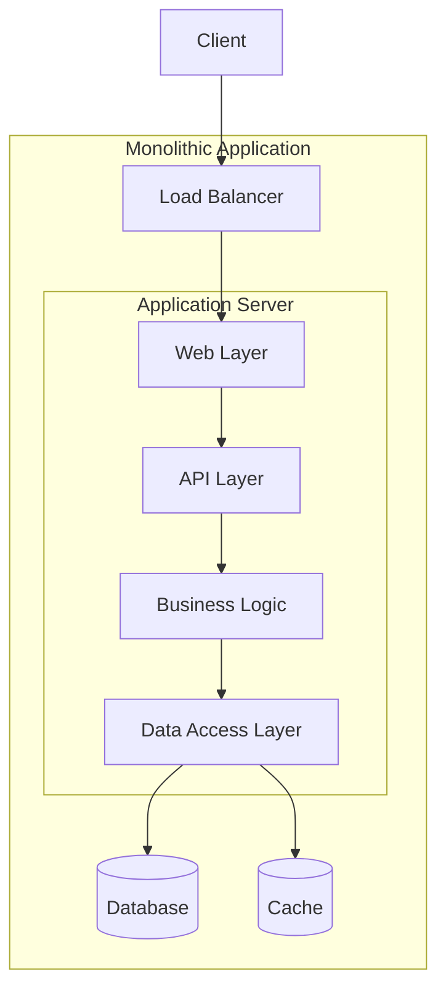

**When to Choose Monolith:**

- Startups with small teams (< 10 developers)
- Simple domain with clear boundaries
- Rapid prototyping requirements
- Limited operational expertise
- Tight budget constraints

**Terraform Pattern - Monolith on AWS:**

```hcl
module "monolith" {
  source = "./modules/monolith"

  # Compute
  instance_type     = "m6i.xlarge"
  min_instances     = 2
  max_instances     = 10
  target_cpu        = 70

  # Database
  db_instance_class = "db.r6g.large"
  db_multi_az       = true
  db_engine         = "postgres"
  db_version        = "15.4"

  # Caching
  cache_node_type   = "cache.r6g.medium"
  cache_num_nodes   = 2

  # Networking
  vpc_cidr          = "10.0.0.0/16"
  azs               = ["us-east-1a", "us-east-1b", "us-east-1c"]
}
```

### Microservices Architecture

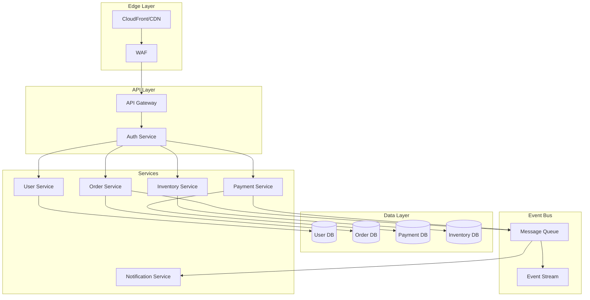

**Service Decomposition Strategies:**

| Strategy                | Description                | Risk Level |
| ----------------------- | -------------------------- | ---------- |
| **Domain-Driven**       | Bounded contexts           | Low        |
| **Business Capability** | Align to org functions     | Low        |
| **Volatility-Based**    | Separate frequent changes  | Medium     |
| **Team-Based**          | One service per team       | Medium     |
| **Data-Based**          | Separate by data ownership | High       |

**Microservices Infrastructure Pattern:**

```hcl
module "microservices_platform" {
  source = "./modules/microservices"

  # Kubernetes Cluster
  cluster_name       = "production"
  kubernetes_version = "1.29"
  node_groups = {
    system = {
      instance_types = ["m6i.large"]
      min_size       = 2
      max_size       = 4
      labels         = { "workload" = "system" }
    }
    application = {
      instance_types = ["m6i.xlarge"]
      min_size       = 3
      max_size       = 20
      labels         = { "workload" = "application" }
    }
    stateful = {
      instance_types = ["r6i.xlarge"]
      min_size       = 2
      max_size       = 6
      labels         = { "workload" = "stateful" }
    }
  }

  # Service Mesh
  enable_istio       = true
  istio_version      = "1.20"
  enable_mtls        = true

  # Observability
  enable_prometheus  = true
  enable_grafana     = true
  enable_jaeger      = true

  # Event Bus
  kafka_broker_count = 3
  kafka_version      = "3.6"
}
```

### Serverless Architecture

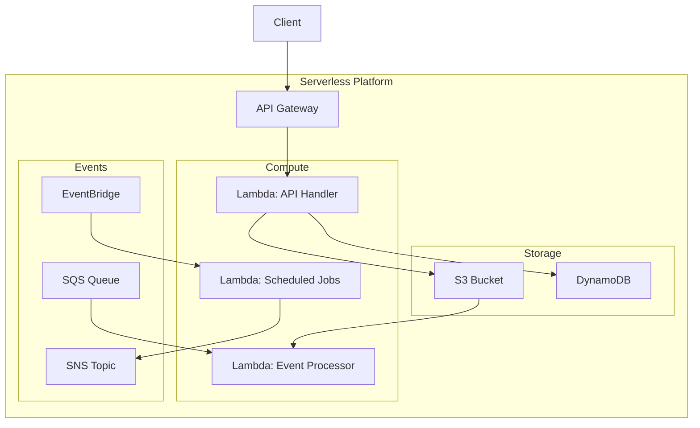

**Serverless Decision Matrix:**

| Factor               | Lambda/Functions | Containers | VMs    |
| -------------------- | ---------------- | ---------- | ------ |
| Cold Start Tolerance | High             | Low        | N/A    |
| Execution Duration   | < 15 min         | Any        | Any    |
| State Requirements   | Stateless        | Either     | Either |
| Cost Pattern         | Sporadic         | Steady     | Steady |
| Operational Overhead | Minimal          | Medium     | High   |

**Serverless Terraform Pattern:**

```hcl
module "serverless_api" {
  source = "./modules/serverless"

  # API Gateway
  api_name        = "production-api"
  api_stage       = "v1"
  throttling_rate = 10000
  throttling_burst = 5000

  # Lambda Functions
  functions = {
    api_handler = {
      handler       = "api.handler"
      runtime       = "python3.12"
      memory_mb     = 1024
      timeout_sec   = 30
      reserved_concurrency = 100
    }
    event_processor = {
      handler       = "processor.handler"
      runtime       = "python3.12"
      memory_mb     = 2048
      timeout_sec   = 900
      reserved_concurrency = 50
    }
  }

  # DynamoDB Tables
  tables = {
    main = {
      hash_key       = "pk"
      range_key      = "sk"
      billing_mode   = "PAY_PER_REQUEST"
      ttl_attribute  = "expires_at"
      global_secondary_indexes = [
        {
          name     = "gsi1"
          hash_key = "gsi1pk"
          range_key = "gsi1sk"
        }
      ]
    }
  }
}
```

---

## 2. High Availability and Disaster Recovery

### HA Architecture Tiers

| Tier       | Availability | Downtime/Year | RTO      | RPO     | Pattern                    | Monthly Cost Multiplier |
| ---------- | ------------ | ------------- | -------- | ------- | -------------------------- | ----------------------- |
| **Tier 1** | 99.99%       | 52 min        | < 1 min  | 0       | Multi-Region Active-Active | 3.0-4.0x                |
| **Tier 2** | 99.95%       | 4.4 hr        | < 15 min | < 1 hr  | Multi-AZ Active-Active     | 2.0-2.5x                |
| **Tier 3** | 99.9%        | 8.8 hr        | < 1 hr   | < 4 hr  | Multi-AZ Active-Passive    | 1.5-2.0x                |
| **Tier 4** | 99.5%        | 44 hr         | < 4 hr   | < 24 hr | Single-AZ + Backup         | 1.0x                    |

### DR Strategy Selection

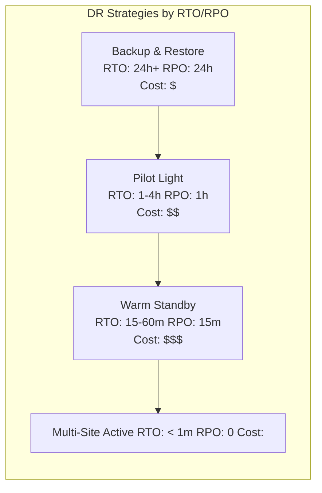

### Multi-Region Active-Active Architecture

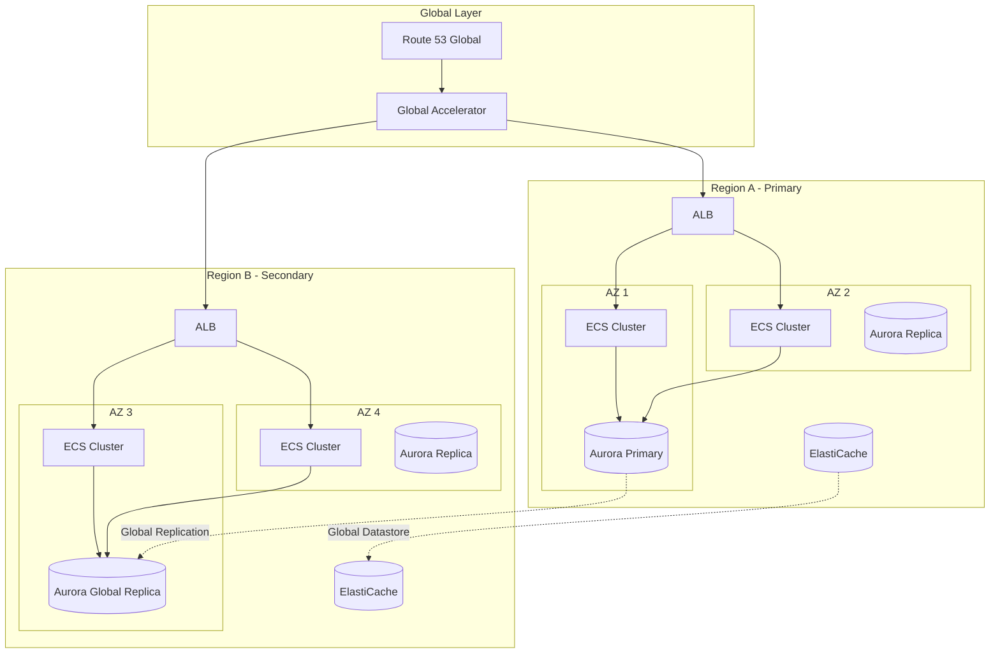

### DR Terraform Module

```hcl
module "disaster_recovery" {
  source = "./modules/dr"

  # Strategy Configuration
  dr_strategy         = "warm_standby"  # backup_restore | pilot_light | warm_standby | active_active
  rto_minutes         = 15
  rpo_minutes         = 5

  # Primary Region
  primary_region      = "us-east-1"
  primary_vpc_cidr    = "10.0.0.0/16"

  # DR Region
  dr_region           = "us-west-2"
  dr_vpc_cidr         = "10.1.0.0/16"

  # Database Replication
  database = {
    engine                   = "aurora-postgresql"
    engine_version           = "15.4"
    instance_class           = "db.r6g.xlarge"
    global_cluster_enabled   = true
    backup_retention_days    = 35
    preferred_backup_window  = "03:00-04:00"
    deletion_protection      = true
  }

  # Storage Replication
  s3_replication = {
    enabled              = true
    destination_bucket   = "dr-bucket-us-west-2"
    replication_time_minutes = 15
    metrics_enabled      = true
  }

  # Compute DR Configuration
  compute_dr = {
    warm_standby_scale   = 0.25  # 25% of primary capacity
    pilot_light_scale    = 0.1   # 10% of primary capacity
    auto_failover        = false # Manual approval required
  }

  # Health Checks
  health_check = {
    type              = "HTTPS"
    resource_path     = "/health"
    failure_threshold = 3
    request_interval  = 10
  }

  # Failover Automation
  failover = {
    automated              = false
    notification_topic_arn = aws_sns_topic.dr_alerts.arn
    runbook_url           = "https://wiki.internal/dr-runbook"
  }
}
```

### DR Runbook Template

````markdown
# Disaster Recovery Runbook

## Pre-Failover Checklist

- [ ] Confirm primary region outage (not transient)
- [ ] Notify stakeholders via PagerDuty/Slack
- [ ] Verify DR region health
- [ ] Check database replication lag
- [ ] Confirm backup integrity

## Failover Procedure

### Step 1: Database Failover (Estimated: 5 minutes)

```bash
# Promote Aurora Global Database secondary to primary
aws rds failover-global-cluster \
  --global-cluster-identifier prod-global-cluster \
  --target-db-cluster-identifier arn:aws:rds:us-west-2:ACCOUNT:cluster:prod-dr
```
````

### Step 2: DNS Failover (Estimated: 2 minutes)

```bash
# Update Route 53 health check to force failover
aws route53 update-health-check \
  --health-check-id HC123456 \
  --disabled
```

### Step 3: Scale DR Compute (Estimated: 5 minutes)

```bash
# Scale up DR region ECS services
aws ecs update-service \
  --cluster prod-dr \
  --service api \
  --desired-count 10

# Scale up DR region Auto Scaling Groups
aws autoscaling set-desired-capacity \
  --auto-scaling-group-name prod-dr-asg \
  --desired-capacity 10
```

## Post-Failover Verification

- [ ] API health checks passing
- [ ] Database connections established
- [ ] Cache warming complete
- [ ] Synthetic monitoring green
- [ ] Customer-facing functionality verified

## Failback Procedure

[Document reverse procedure here]

````

---

## 3. Auto-Scaling Strategies

### Scaling Strategy Matrix

| Strategy | Trigger Type | Response Time | Use Case | Complexity |
|----------|--------------|---------------|----------|------------|
| **Target Tracking** | Metric threshold | 2-5 min | Steady workloads | Low |
| **Step Scaling** | Metric breaches | 1-3 min | Variable workloads | Medium |
| **Scheduled** | Time-based | Instant | Predictable patterns | Low |
| **Predictive** | ML forecast | Pre-emptive | Complex patterns | High |
| **Event-Driven** | Queue depth | 30s-2 min | Async processing | Medium |

### Comprehensive Auto-Scaling Architecture

```mermaid
graph TB
    subgraph "Scaling Triggers"
        CW[CloudWatch Metrics]
        SQS[SQS Queue Depth]
        Custom[Custom Metrics]
        Schedule[Scheduled Events]
        ML[Predictive ML]
    end

    subgraph "Scaling Policies"
        TT[Target Tracking]
        SS[Step Scaling]
        SC[Scheduled Scaling]
        PS[Predictive Scaling]
    end

    subgraph "Compute Targets"
        ASG[EC2 Auto Scaling]
        ECS[ECS Service]
        Lambda[Lambda Concurrency]
        K8s[Kubernetes HPA/VPA/KEDA]
    end

    CW --> TT
    CW --> SS
    Schedule --> SC
    ML --> PS
    SQS --> SS
    Custom --> TT

    TT --> ASG
    TT --> ECS
    SS --> ASG
    SS --> ECS
    SC --> ASG
    PS --> ASG
    Custom --> K8s
    SQS --> Lambda
````

### Kubernetes Auto-Scaling Configuration

```yaml
# Horizontal Pod Autoscaler (HPA)
apiVersion: autoscaling/v2
kind: HorizontalPodAutoscaler
metadata:
  name: api-hpa
  namespace: production
spec:
  scaleTargetRef:
    apiVersion: apps/v1
    kind: Deployment
    name: api
  minReplicas: 3
  maxReplicas: 50
  metrics:
    - type: Resource
      resource:
        name: cpu
        target:
          type: Utilization
          averageUtilization: 70
    - type: Resource
      resource:
        name: memory
        target:
          type: Utilization
          averageUtilization: 80
    - type: Pods
      pods:
        metric:
          name: http_requests_per_second
        target:
          type: AverageValue
          averageValue: "1000"
  behavior:
    scaleDown:
      stabilizationWindowSeconds: 300
      policies:
        - type: Percent
          value: 10
          periodSeconds: 60
    scaleUp:
      stabilizationWindowSeconds: 0
      policies:
        - type: Percent
          value: 100
          periodSeconds: 15
        - type: Pods
          value: 4
          periodSeconds: 15
      selectPolicy: Max
---
# Vertical Pod Autoscaler (VPA)
apiVersion: autoscaling.k8s.io/v1
kind: VerticalPodAutoscaler
metadata:
  name: api-vpa
  namespace: production
spec:
  targetRef:
    apiVersion: apps/v1
    kind: Deployment
    name: api
  updatePolicy:
    updateMode: "Auto"
  resourcePolicy:
    containerPolicies:
      - containerName: api
        minAllowed:
          cpu: 100m
          memory: 128Mi
        maxAllowed:
          cpu: 4
          memory: 8Gi
        controlledResources: ["cpu", "memory"]
---
# KEDA ScaledObject for Event-Driven Scaling
apiVersion: keda.sh/v1alpha1
kind: ScaledObject
metadata:
  name: worker-scaledobject
  namespace: production
spec:
  scaleTargetRef:
    name: worker
  minReplicaCount: 1
  maxReplicaCount: 100
  pollingInterval: 15
  cooldownPeriod: 300
  triggers:
    - type: aws-sqs-queue
      metadata:
        queueURL: https://sqs.us-east-1.amazonaws.com/123456789/worker-queue
        queueLength: "50"
        awsRegion: us-east-1
    - type: prometheus
      metadata:
        serverAddress: http://prometheus:9090
        metricName: pending_jobs
        threshold: "100"
        query: sum(pending_jobs{job="worker"})
```

### AWS Auto-Scaling Terraform

```hcl
module "auto_scaling" {
  source = "./modules/auto-scaling"

  # Target Tracking Policies
  target_tracking_policies = {
    cpu = {
      predefined_metric = "ASGAverageCPUUtilization"
      target_value      = 70
      scale_in_cooldown  = 300
      scale_out_cooldown = 60
    }
    alb_requests = {
      predefined_metric = "ALBRequestCountPerTarget"
      target_value      = 1000
      scale_in_cooldown  = 300
      scale_out_cooldown = 60
    }
  }

  # Step Scaling Policies
  step_scaling_policies = {
    high_cpu = {
      metric_name         = "CPUUtilization"
      comparison_operator = "GreaterThanThreshold"
      threshold           = 85
      evaluation_periods  = 2
      period              = 60
      step_adjustments = [
        { lower = 0, upper = 10, adjustment = 1 },
        { lower = 10, upper = 20, adjustment = 2 },
        { lower = 20, adjustment = 4 }
      ]
    }
  }

  # Scheduled Scaling
  scheduled_actions = {
    scale_up_morning = {
      schedule     = "cron(0 8 * * MON-FRI)"
      min_size     = 5
      max_size     = 20
      desired_size = 10
    }
    scale_down_evening = {
      schedule     = "cron(0 20 * * MON-FRI)"
      min_size     = 2
      max_size     = 10
      desired_size = 3
    }
    scale_up_weekend_promo = {
      schedule     = "cron(0 0 * * SAT)"
      min_size     = 10
      max_size     = 50
      desired_size = 20
    }
  }

  # Predictive Scaling
  predictive_scaling = {
    enabled                   = true
    mode                      = "ForecastAndScale"  # ForecastOnly | ForecastAndScale
    scheduling_buffer_time    = 300  # 5 minutes ahead
    max_capacity_breach_behavior = "IncreaseMaxCapacity"
    max_capacity_buffer       = 10  # 10% additional capacity
  }

  # Warm Pool Configuration
  warm_pool = {
    enabled                     = true
    max_group_prepared_capacity = 5
    min_size                    = 2
    instance_reuse_policy       = "Reuse"
    pool_state                  = "Stopped"  # Stopped | Running | Hibernated
  }
}
```

---

## 4. Network Topology Design

### Network Architecture Patterns

#### Hub-and-Spoke Topology

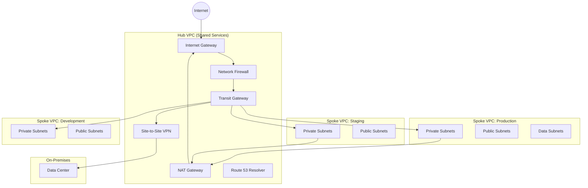

### Network Segmentation Strategy

| Subnet Tier      | CIDR Range | Internet Access | Resources                    | Security Level |
| ---------------- | ---------- | --------------- | ---------------------------- | -------------- |
| **Public**       | /24        | Direct (IGW)    | ALB, NAT, Bastion            | Low            |
| **Private App**  | /23        | NAT only        | EC2, ECS, Lambda             | Medium         |
| **Private Data** | /24        | None            | RDS, ElastiCache, OpenSearch | High           |
| **Management**   | /26        | VPN only        | Monitoring, CI/CD agents     | High           |
| **Transit**      | /28        | None            | TGW attachments              | Critical       |

### Comprehensive VPC Terraform Module

```hcl
module "network" {
  source = "./modules/network"

  # VPC Configuration
  vpc_name           = "production"
  vpc_cidr           = "10.0.0.0/16"
  enable_dns_hostnames = true
  enable_dns_support   = true

  # Availability Zones
  azs = ["us-east-1a", "us-east-1b", "us-east-1c"]

  # Subnet Configuration
  subnets = {
    public = {
      cidrs            = ["10.0.0.0/24", "10.0.1.0/24", "10.0.2.0/24"]
      map_public_ip    = true
      route_to_igw     = true
    }
    private_app = {
      cidrs            = ["10.0.10.0/23", "10.0.12.0/23", "10.0.14.0/23"]
      map_public_ip    = false
      route_to_nat     = true
    }
    private_data = {
      cidrs            = ["10.0.20.0/24", "10.0.21.0/24", "10.0.22.0/24"]
      map_public_ip    = false
      route_to_nat     = false  # Isolated
    }
    management = {
      cidrs            = ["10.0.30.0/26", "10.0.30.64/26", "10.0.30.128/26"]
      map_public_ip    = false
      route_to_nat     = true
    }
  }

  # NAT Gateway Configuration
  nat_gateway = {
    enabled           = true
    single_nat        = false  # One per AZ for HA
    elastic_ip_allocation = true
  }

  # VPC Endpoints (PrivateLink)
  vpc_endpoints = {
    gateway = ["s3", "dynamodb"]
    interface = [
      "ec2",
      "ecr.api",
      "ecr.dkr",
      "ecs",
      "ecs-agent",
      "ecs-telemetry",
      "logs",
      "monitoring",
      "ssm",
      "ssmmessages",
      "ec2messages",
      "secretsmanager",
      "kms",
      "sqs",
      "sns",
      "sts"
    ]
  }

  # Transit Gateway Attachment
  transit_gateway = {
    enabled           = true
    tgw_id            = data.aws_ec2_transit_gateway.shared.id
    attachment_subnet_cidrs = ["10.0.31.0/28", "10.0.31.16/28", "10.0.31.32/28"]
    route_table_association = "production"
    route_table_propagation = ["shared-services", "security"]
  }

  # VPC Flow Logs
  flow_logs = {
    enabled                = true
    traffic_type           = "ALL"
    destination            = "cloud-watch-logs"  # cloud-watch-logs | s3
    log_retention_days     = 30
    enable_s3_backup       = true
    s3_bucket_arn          = aws_s3_bucket.flow_logs.arn
  }

  # Network Firewall
  network_firewall = {
    enabled                = true
    firewall_policy_arn    = aws_networkfirewall_firewall_policy.main.arn
    subnet_cidrs           = ["10.0.32.0/28", "10.0.32.16/28", "10.0.32.32/28"]
    delete_protection      = true
    logging = {
      flow_logs_enabled    = true
      alert_logs_enabled   = true
      destination_type     = "CloudWatchLogs"
    }
  }

  # DNS Configuration
  dns = {
    enable_private_zone    = true
    private_zone_name      = "internal.company.com"
    enable_resolver_endpoints = true
    resolver_inbound_cidrs  = ["10.0.33.0/28", "10.0.33.16/28"]
    resolver_outbound_cidrs = ["10.0.33.32/28", "10.0.33.48/28"]
    forward_rules = [
      {
        domain_name = "onprem.company.com"
        target_ips  = ["192.168.1.10", "192.168.1.11"]
      }
    ]
  }

  # Tags
  tags = {
    Environment = "production"
    CostCenter  = "infrastructure"
    Compliance  = "soc2"
  }
}
```

### Network Security Groups Architecture

```hcl
# Security Group Rules Matrix
locals {
  security_group_rules = {
    alb = {
      ingress = [
        { from = 443, to = 443, protocol = "tcp", cidr = "0.0.0.0/0", desc = "HTTPS" },
        { from = 80, to = 80, protocol = "tcp", cidr = "0.0.0.0/0", desc = "HTTP redirect" }
      ]
      egress = [
        { from = 0, to = 65535, protocol = "-1", cidr = "10.0.0.0/16", desc = "VPC internal" }
      ]
    }

    app = {
      ingress = [
        { from = 8080, to = 8080, protocol = "tcp", source_sg = "alb", desc = "From ALB" },
        { from = 22, to = 22, protocol = "tcp", source_sg = "bastion", desc = "SSH from bastion" }
      ]
      egress = [
        { from = 443, to = 443, protocol = "tcp", cidr = "0.0.0.0/0", desc = "HTTPS outbound" },
        { from = 5432, to = 5432, protocol = "tcp", source_sg = "database", desc = "PostgreSQL" },
        { from = 6379, to = 6379, protocol = "tcp", source_sg = "cache", desc = "Redis" }
      ]
    }

    database = {
      ingress = [
        { from = 5432, to = 5432, protocol = "tcp", source_sg = "app", desc = "PostgreSQL from app" }
      ]
      egress = []  # No egress for databases
    }

    cache = {
      ingress = [
        { from = 6379, to = 6379, protocol = "tcp", source_sg = "app", desc = "Redis from app" }
      ]
      egress = []  # No egress for cache
    }

    bastion = {
      ingress = [
        { from = 22, to = 22, protocol = "tcp", cidr = "CORPORATE_IP/32", desc = "SSH from office" }
      ]
      egress = [
        { from = 22, to = 22, protocol = "tcp", cidr = "10.0.0.0/16", desc = "SSH to VPC" }
      ]
    }
  }
}
```

---

## 5. Security Architecture

### Zero Trust Architecture

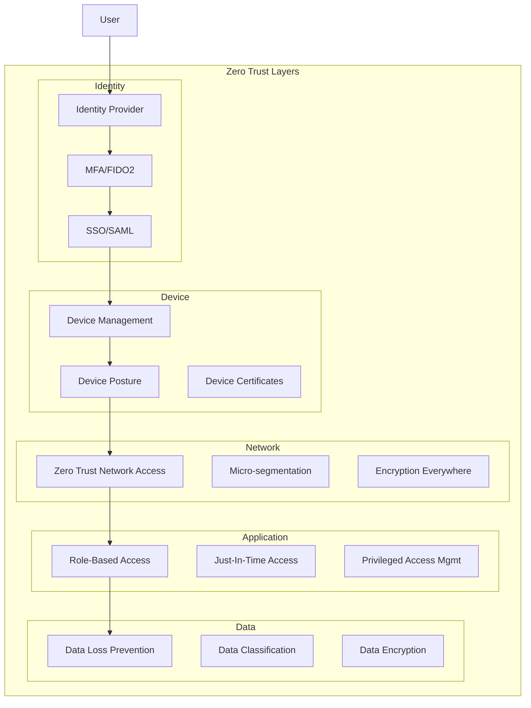

### Defense in Depth Implementation

| Layer           | Component              | AWS Service           | Implementation                  |
| --------------- | ---------------------- | --------------------- | ------------------------------- |
| **Edge**        | DDoS Protection        | Shield Advanced       | Always-on, auto-mitigation      |
| **Edge**        | WAF                    | AWS WAF               | OWASP rules, rate limiting      |
| **Edge**        | CDN                    | CloudFront            | Origin protection, geo-blocking |
| **Network**     | Firewall               | Network Firewall      | Stateful inspection, IDS/IPS    |
| **Network**     | Segmentation           | Security Groups       | Micro-segmentation              |
| **Network**     | Traffic Inspection     | VPC Traffic Mirroring | Full packet capture             |
| **Identity**    | Authentication         | Cognito/IAM           | MFA, federation                 |
| **Identity**    | Authorization          | IAM Policies          | Least privilege                 |
| **Identity**    | Secrets                | Secrets Manager       | Auto-rotation                   |
| **Data**        | Encryption at Rest     | KMS                   | CMK, envelope encryption        |
| **Data**        | Encryption in Transit  | ACM                   | TLS 1.3, cert rotation          |
| **Application** | Runtime Protection     | GuardDuty             | Threat detection                |
| **Application** | Vulnerability Scanning | Inspector             | Continuous scanning             |

### Security Terraform Module

```hcl
module "security" {
  source = "./modules/security"

  # WAF Configuration
  waf = {
    enabled = true
    scope   = "REGIONAL"  # REGIONAL | CLOUDFRONT
    rules = {
      aws_managed_rules = [
        {
          name            = "AWSManagedRulesCommonRuleSet"
          priority        = 10
          override_action = "none"
        },
        {
          name            = "AWSManagedRulesKnownBadInputsRuleSet"
          priority        = 20
          override_action = "none"
        },
        {
          name            = "AWSManagedRulesSQLiRuleSet"
          priority        = 30
          override_action = "none"
        },
        {
          name            = "AWSManagedRulesLinuxRuleSet"
          priority        = 40
          override_action = "none"
        }
      ]
      rate_limit = {
        enabled   = true
        limit     = 2000
        priority  = 1
      }
      geo_blocking = {
        enabled        = true
        blocked_countries = ["RU", "CN", "KP", "IR"]
        priority       = 5
      }
      ip_reputation = {
        enabled  = true
        priority = 2
      }
    }
    logging = {
      enabled       = true
      s3_bucket_arn = aws_s3_bucket.waf_logs.arn
      redacted_fields = ["cookie", "authorization"]
    }
  }

  # KMS Configuration
  kms = {
    keys = {
      application = {
        description          = "Application encryption key"
        enable_key_rotation  = true
        deletion_window_days = 30
        policy               = data.aws_iam_policy_document.kms_app.json
      }
      database = {
        description          = "Database encryption key"
        enable_key_rotation  = true
        deletion_window_days = 30
        policy               = data.aws_iam_policy_document.kms_db.json
      }
      secrets = {
        description          = "Secrets Manager encryption key"
        enable_key_rotation  = true
        deletion_window_days = 30
        policy               = data.aws_iam_policy_document.kms_secrets.json
      }
    }
  }

  # Secrets Manager Configuration
  secrets_manager = {
    rotation_enabled   = true
    rotation_days      = 30
    secrets = {
      database = {
        description = "Database credentials"
        rotation_lambda_arn = aws_lambda_function.rotate_db.arn
      }
      api_keys = {
        description = "External API keys"
        rotation_lambda_arn = aws_lambda_function.rotate_api.arn
      }
    }
  }

  # GuardDuty Configuration
  guardduty = {
    enabled = true
    finding_publishing_frequency = "FIFTEEN_MINUTES"
    s3_protection     = true
    kubernetes_protection = true
    malware_protection = true
    ebs_volumes_protection = true
  }

  # Security Hub Configuration
  security_hub = {
    enabled = true
    standards = [
      "aws-foundational-security-best-practices/v/1.0.0",
      "cis-aws-foundations-benchmark/v/1.4.0",
      "pci-dss/v/3.2.1"
    ]
    auto_enable_controls = true
  }

  # IAM Configuration
  iam = {
    password_policy = {
      minimum_length        = 14
      require_lowercase     = true
      require_uppercase     = true
      require_numbers       = true
      require_symbols       = true
      max_age_days          = 90
      password_reuse_prevention = 24
      allow_users_to_change = true
    }

    service_roles = {
      ecs_task = {
        assume_role_policy = data.aws_iam_policy_document.ecs_assume.json
        managed_policies   = ["arn:aws:iam::aws:policy/service-role/AmazonECSTaskExecutionRolePolicy"]
        inline_policies    = [data.aws_iam_policy_document.ecs_task.json]
      }
    }

    permission_boundaries = {
      developer = data.aws_iam_policy_document.dev_boundary.json
      admin     = data.aws_iam_policy_document.admin_boundary.json
    }
  }

  # Certificate Manager
  acm = {
    certificates = {
      main = {
        domain_name       = "example.com"
        san               = ["*.example.com", "api.example.com"]
        validation_method = "DNS"
        key_algorithm     = "EC_prime256v1"
      }
    }
  }
}
```

### IAM Least Privilege Pattern

```hcl
# Service-specific IAM policies with explicit deny
data "aws_iam_policy_document" "application_role" {
  # Allow only necessary actions
  statement {
    sid    = "AllowS3BucketAccess"
    effect = "Allow"
    actions = [
      "s3:GetObject",
      "s3:PutObject",
      "s3:ListBucket"
    ]
    resources = [
      aws_s3_bucket.app.arn,
      "${aws_s3_bucket.app.arn}/*"
    ]
    condition {
      test     = "StringEquals"
      variable = "s3:x-amz-acl"
      values   = ["private"]
    }
  }

  statement {
    sid    = "AllowDynamoDBAccess"
    effect = "Allow"
    actions = [
      "dynamodb:GetItem",
      "dynamodb:PutItem",
      "dynamodb:UpdateItem",
      "dynamodb:DeleteItem",
      "dynamodb:Query"
    ]
    resources = [
      aws_dynamodb_table.main.arn,
      "${aws_dynamodb_table.main.arn}/index/*"
    ]
    condition {
      test     = "ForAllValues:StringEquals"
      variable = "dynamodb:LeadingKeys"
      values   = ["$${aws:PrincipalTag/TenantId}"]
    }
  }

  statement {
    sid    = "AllowSecretsAccess"
    effect = "Allow"
    actions = [
      "secretsmanager:GetSecretValue"
    ]
    resources = [
      "arn:aws:secretsmanager:*:*:secret:app/*"
    ]
    condition {
      test     = "StringEquals"
      variable = "secretsmanager:ResourceTag/Environment"
      values   = [var.environment]
    }
  }

  # Explicit deny for sensitive actions
  statement {
    sid    = "DenyDeleteActions"
    effect = "Deny"
    actions = [
      "s3:DeleteBucket",
      "dynamodb:DeleteTable",
      "rds:DeleteDBInstance"
    ]
    resources = ["*"]
  }

  statement {
    sid    = "DenyUnencryptedTransport"
    effect = "Deny"
    actions = ["*"]
    resources = ["*"]
    condition {
      test     = "Bool"
      variable = "aws:SecureTransport"
      values   = ["false"]
    }
  }
}
```

---

## 6. Cost Optimization at Scale

### Cost Optimization Framework

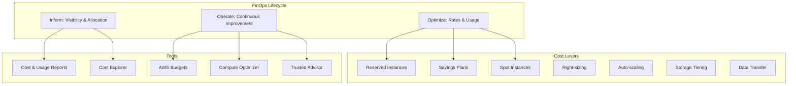

### Cost Optimization Strategies by Service

| Service           | Strategy                 | Savings Potential | Implementation Effort | Risk Level |
| ----------------- | ------------------------ | ----------------- | --------------------- | ---------- |
| **EC2**           | Reserved Instances (1yr) | 30-40%            | Low                   | Low        |
| **EC2**           | Reserved Instances (3yr) | 50-60%            | Low                   | Medium     |
| **EC2**           | Savings Plans            | 30-50%            | Low                   | Low        |
| **EC2**           | Spot Instances           | 60-90%            | High                  | High       |
| **EC2**           | Right-sizing             | 20-40%            | Medium                | Low        |
| **EC2**           | ARM/Graviton             | 20-40%            | Medium                | Medium     |
| **RDS**           | Reserved Instances       | 30-60%            | Low                   | Low        |
| **RDS**           | Aurora Serverless v2     | Variable          | Medium                | Medium     |
| **S3**            | Intelligent Tiering      | 40-70%            | Low                   | Low        |
| **S3**            | Lifecycle Policies       | 60-80%            | Low                   | Low        |
| **Lambda**        | ARM64                    | 20-34%            | Low                   | Low        |
| **Lambda**        | Provisioned Concurrency  | Variable          | Medium                | Low        |
| **Data Transfer** | VPC Endpoints            | 30-50%            | Medium                | Low        |
| **Data Transfer** | CDN Caching              | 40-60%            | Medium                | Low        |

### Cost Optimization Terraform Module

```hcl
module "cost_optimization" {
  source = "./modules/cost-optimization"

  # Savings Plans Analysis
  savings_plans = {
    compute_sp = {
      commitment_amount = 10.0  # $/hour
      term_length       = "ONE_YEAR"
      payment_option    = "PARTIAL_UPFRONT"
    }
  }

  # Reserved Instances
  reserved_instances = {
    enabled = true
    recommendations_filter = {
      instance_family = ["m6i", "r6i", "c6i"]
      min_utilization = 70
      lookback_period = "SIXTY_DAYS"
    }
  }

  # Spot Instance Configuration
  spot_config = {
    enabled = true
    allocation_strategy = "price-capacity-optimized"
    max_spot_percentage = 70
    instance_pools      = 10
    interruption_behavior = "terminate"

    # Spot Fleet
    fleet = {
      target_capacity = 10
      terminate_instances_with_expiration = true
      replace_unhealthy_instances = true
      instance_types = ["m6i.large", "m6i.xlarge", "m5.large", "m5.xlarge"]
    }
  }

  # Right-sizing Configuration
  rightsizing = {
    enabled = true
    lookback_period = "FOURTEEN_DAYS"
    utilization_preferences = {
      cpu_threshold    = 40
      memory_threshold = 40
    }
    recommendation_targets = ["SAME_INSTANCE_FAMILY", "CROSS_INSTANCE_FAMILY"]
  }

  # S3 Lifecycle Policies
  s3_lifecycle = {
    logs = {
      transition = [
        { days = 30, storage_class = "STANDARD_IA" },
        { days = 90, storage_class = "GLACIER" },
        { days = 365, storage_class = "DEEP_ARCHIVE" }
      ]
      expiration_days = 730
    }
    backups = {
      transition = [
        { days = 7, storage_class = "STANDARD_IA" },
        { days = 30, storage_class = "GLACIER" }
      ]
      expiration_days = 365
    }
  }

  # Budget Alerts
  budgets = {
    monthly = {
      limit_amount = 50000
      time_unit    = "MONTHLY"
      alerts = [
        { threshold = 50, notification_type = "ACTUAL", subscribers = ["team@company.com"] },
        { threshold = 80, notification_type = "ACTUAL", subscribers = ["team@company.com", "finance@company.com"] },
        { threshold = 100, notification_type = "ACTUAL", subscribers = ["team@company.com", "finance@company.com", "cto@company.com"] },
        { threshold = 80, notification_type = "FORECASTED", subscribers = ["team@company.com"] }
      ]
    }
    per_service = {
      ec2 = { limit = 20000, threshold = 80 }
      rds = { limit = 10000, threshold = 80 }
      s3  = { limit = 5000, threshold = 80 }
    }
  }

  # Cost Allocation Tags
  cost_allocation_tags = [
    "Environment",
    "Project",
    "Team",
    "CostCenter",
    "Application"
  ]

  # Anomaly Detection
  anomaly_detection = {
    enabled = true
    monitors = [
      {
        name = "service-monitor"
        type = "DIMENSIONAL"
        dimension = "SERVICE"
        threshold_expression = {
          dimension = "ANOMALY_TOTAL_IMPACT_PERCENTAGE"
          operator  = "GREATER_THAN"
          value     = 10
        }
      }
    ]
    subscribers = ["finops@company.com"]
  }
}
```

### Cost Estimation Template

```markdown
## Infrastructure Cost Estimate: Production Environment

### Executive Summary

| Metric                       | Value          |
| ---------------------------- | -------------- |
| **Monthly Cost (On-Demand)** | $45,000        |
| **Monthly Cost (Optimized)** | $28,500        |
| **Annual Savings**           | $198,000 (37%) |

### Compute Costs

| Resource     | Type        | Quantity | Hours/Month | On-Demand Rate | Optimized Rate   | Monthly Cost |
| ------------ | ----------- | -------- | ----------- | -------------- | ---------------- | ------------ |
| Web Tier     | m6i.xlarge  | 6        | 730         | $0.192/hr      | $0.121/hr (RI)   | $530         |
| App Tier     | m6i.2xlarge | 10       | 730         | $0.384/hr      | $0.115/hr (Spot) | $840         |
| Worker       | c6i.xlarge  | 8        | 730         | $0.170/hr      | $0.051/hr (Spot) | $298         |
| **Subtotal** |             |          |             |                |                  | **$1,668**   |

### Database Costs

| Resource        | Type               | Storage | On-Demand Rate | Reserved Rate  | Monthly Cost |
| --------------- | ------------------ | ------- | -------------- | -------------- | ------------ |
| Aurora Primary  | db.r6g.xlarge      | 500GB   | $0.58/hr       | $0.37/hr (RI)  | $270         |
| Aurora Replicas | db.r6g.large x2    | -       | $0.29/hr       | $0.18/hr (RI)  | $263         |
| Aurora Storage  | -                  | 500GB   | $0.10/GB       | $0.10/GB       | $50          |
| ElastiCache     | cache.r6g.large x3 | -       | $0.182/hr      | $0.115/hr (RI) | $252         |
| **Subtotal**    |                    |         |                |                | **$835**     |

### Storage Costs

| Resource     | Type          | Size | Rate       | Monthly Cost |
| ------------ | ------------- | ---- | ---------- | ------------ |
| S3 Standard  | Active data   | 5TB  | $0.023/GB  | $115         |
| S3 IA        | Archived data | 20TB | $0.0125/GB | $250         |
| S3 Glacier   | Backups       | 50TB | $0.004/GB  | $200         |
| EBS gp3      | Application   | 2TB  | $0.08/GB   | $160         |
| **Subtotal** |               |      |            | **$725**     |

### Networking Costs

| Resource      | Type           | Usage | Rate        | Monthly Cost |
| ------------- | -------------- | ----- | ----------- | ------------ |
| NAT Gateway   | Data processed | 5TB   | $0.045/GB   | $225         |
| Data Transfer | Outbound       | 10TB  | $0.09/GB    | $900         |
| CloudFront    | Requests       | 100M  | $0.0075/10K | $75          |
| CloudFront    | Data Transfer  | 8TB   | $0.085/GB   | $680         |
| **Subtotal**  |                |       |             | **$1,880**   |

### Optimization Recommendations

| Strategy                 | Current Cost | Optimized Cost | Savings       | Implementation |
| ------------------------ | ------------ | -------------- | ------------- | -------------- |
| EC2 Savings Plans        | $15,000      | $10,500        | $4,500/mo     | Immediate      |
| RDS Reserved             | $8,000       | $5,200         | $2,800/mo     | 1 week         |
| Spot for Workers         | $2,000       | $600           | $1,400/mo     | 2 weeks        |
| S3 Lifecycle             | $1,500       | $565           | $935/mo       | 1 week         |
| NAT Gateway Optimization | $500         | $250           | $250/mo       | 1 week         |
| **Total Savings**        |              |                | **$9,885/mo** |                |
```

---

## 7. Infrastructure as Code Best Practices

### IaC Project Structure

```
infrastructure/
+-- modules/                      # Reusable modules
|   +-- networking/
|   |   +-- main.tf
|   |   +-- variables.tf
|   |   +-- outputs.tf
|   |   +-- versions.tf
|   |   +-- README.md
|   +-- compute/
|   +-- database/
|   +-- security/
|   +-- observability/
+-- environments/                 # Environment-specific configs
|   +-- dev/
|   |   +-- main.tf
|   |   +-- terraform.tfvars
|   |   +-- backend.tf
|   +-- staging/
|   +-- production/
+-- global/                       # Shared resources
|   +-- iam/
|   +-- dns/
|   +-- ecr/
+-- scripts/                      # Helper scripts
|   +-- init.sh
|   +-- plan.sh
|   +-- apply.sh
+-- tests/                        # Infrastructure tests
|   +-- unit/
|   +-- integration/
+-- docs/                         # Documentation
|   +-- architecture.md
|   +-- runbooks/
+-- .github/
|   +-- workflows/
|       +-- terraform-plan.yml
|       +-- terraform-apply.yml
+-- .pre-commit-config.yaml
+-- .tflint.hcl
+-- .terraform-version
```

### Terraform Best Practices Module

```hcl
# versions.tf - Pin all versions
terraform {
  required_version = ">= 1.6.0, < 2.0.0"

  required_providers {
    aws = {
      source  = "hashicorp/aws"
      version = "~> 5.30"
    }
    kubernetes = {
      source  = "hashicorp/kubernetes"
      version = "~> 2.24"
    }
    helm = {
      source  = "hashicorp/helm"
      version = "~> 2.12"
    }
  }

  backend "s3" {
    bucket         = "company-terraform-state"
    key            = "production/terraform.tfstate"
    region         = "us-east-1"
    encrypt        = true
    dynamodb_table = "terraform-locks"
    kms_key_id     = "alias/terraform-state"
  }
}

# provider.tf - Provider configuration
provider "aws" {
  region = var.aws_region

  default_tags {
    tags = {
      Environment = var.environment
      ManagedBy   = "terraform"
      Project     = var.project_name
      Repository  = "github.com/company/infrastructure"
    }
  }

  # Assume role for cross-account access
  assume_role {
    role_arn     = "arn:aws:iam::${var.target_account_id}:role/TerraformExecutionRole"
    session_name = "terraform-${var.environment}"
    external_id  = var.external_id
  }
}
```

### Terraform Module Standards

```hcl
# modules/networking/variables.tf
variable "vpc_name" {
  description = "Name of the VPC"
  type        = string

  validation {
    condition     = can(regex("^[a-z0-9-]+$", var.vpc_name))
    error_message = "VPC name must be lowercase alphanumeric with hyphens only."
  }
}

variable "vpc_cidr" {
  description = "CIDR block for VPC"
  type        = string

  validation {
    condition     = can(cidrhost(var.vpc_cidr, 0))
    error_message = "Must be a valid CIDR block."
  }

  validation {
    condition     = tonumber(split("/", var.vpc_cidr)[1]) <= 20
    error_message = "VPC CIDR must be /20 or larger."
  }
}

variable "environment" {
  description = "Environment name"
  type        = string

  validation {
    condition     = contains(["dev", "staging", "production"], var.environment)
    error_message = "Environment must be dev, staging, or production."
  }
}

variable "enable_nat_gateway" {
  description = "Enable NAT Gateway for private subnets"
  type        = bool
  default     = true
}

variable "single_nat_gateway" {
  description = "Use single NAT Gateway (cost saving, not HA)"
  type        = bool
  default     = false
}

variable "tags" {
  description = "Additional tags for all resources"
  type        = map(string)
  default     = {}
}
```

### CI/CD Pipeline for IaC

```yaml
# .github/workflows/terraform.yml
name: Terraform CI/CD

on:
  push:
    branches: [main]
    paths: ["infrastructure/**"]
  pull_request:
    branches: [main]
    paths: ["infrastructure/**"]

env:
  TF_VERSION: "1.6.6"
  TFLINT_VERSION: "0.50.0"
  AWS_REGION: "us-east-1"

jobs:
  validate:
    name: Validate
    runs-on: ubuntu-latest
    steps:
      - uses: actions/checkout@v4

      - name: Setup Terraform
        uses: hashicorp/setup-terraform@v3
        with:
          terraform_version: ${{ env.TF_VERSION }}

      - name: Terraform Format Check
        run: terraform fmt -check -recursive
        working-directory: infrastructure

      - name: Setup TFLint
        uses: terraform-linters/setup-tflint@v4
        with:
          tflint_version: ${{ env.TFLINT_VERSION }}

      - name: TFLint
        run: |
          tflint --init
          tflint --recursive
        working-directory: infrastructure

      - name: Checkov Security Scan
        uses: bridgecrewio/checkov-action@v12
        with:
          directory: infrastructure
          framework: terraform
          soft_fail: false
          output_format: sarif
          output_file_path: checkov.sarif

      - name: Upload SARIF
        uses: github/codeql-action/upload-sarif@v3
        with:
          sarif_file: checkov.sarif

  plan:
    name: Plan (${{ matrix.environment }})
    needs: validate
    runs-on: ubuntu-latest
    strategy:
      matrix:
        environment: [dev, staging, production]
    environment: ${{ matrix.environment }}
    steps:
      - uses: actions/checkout@v4

      - name: Setup Terraform
        uses: hashicorp/setup-terraform@v3
        with:
          terraform_version: ${{ env.TF_VERSION }}

      - name: Configure AWS Credentials
        uses: aws-actions/configure-aws-credentials@v4
        with:
          role-to-assume: ${{ secrets.AWS_ROLE_ARN }}
          aws-region: ${{ env.AWS_REGION }}

      - name: Terraform Init
        run: terraform init -backend-config="key=${{ matrix.environment }}/terraform.tfstate"
        working-directory: infrastructure/environments/${{ matrix.environment }}

      - name: Terraform Plan
        run: |
          terraform plan \
            -var-file=terraform.tfvars \
            -out=tfplan \
            -detailed-exitcode
        working-directory: infrastructure/environments/${{ matrix.environment }}
        continue-on-error: true

      - name: Upload Plan
        uses: actions/upload-artifact@v4
        with:
          name: tfplan-${{ matrix.environment }}
          path: infrastructure/environments/${{ matrix.environment }}/tfplan

      - name: Plan Summary
        uses: actions/github-script@v7
        with:
          script: |
            const fs = require('fs');
            const planOutput = fs.readFileSync('infrastructure/environments/${{ matrix.environment }}/plan.txt', 'utf8');
            github.rest.issues.createComment({
              issue_number: context.issue.number,
              owner: context.repo.owner,
              repo: context.repo.repo,
              body: `### Terraform Plan for ${{ matrix.environment }}\n\`\`\`hcl\n${planOutput}\n\`\`\``
            });

  apply:
    name: Apply (${{ matrix.environment }})
    needs: plan
    if: github.ref == 'refs/heads/main' && github.event_name == 'push'
    runs-on: ubuntu-latest
    strategy:
      matrix:
        environment: [dev, staging, production]
      max-parallel: 1
    environment: ${{ matrix.environment }}
    steps:
      - uses: actions/checkout@v4

      - name: Setup Terraform
        uses: hashicorp/setup-terraform@v3
        with:
          terraform_version: ${{ env.TF_VERSION }}

      - name: Configure AWS Credentials
        uses: aws-actions/configure-aws-credentials@v4
        with:
          role-to-assume: ${{ secrets.AWS_ROLE_ARN }}
          aws-region: ${{ env.AWS_REGION }}

      - name: Download Plan
        uses: actions/download-artifact@v4
        with:
          name: tfplan-${{ matrix.environment }}
          path: infrastructure/environments/${{ matrix.environment }}

      - name: Terraform Init
        run: terraform init -backend-config="key=${{ matrix.environment }}/terraform.tfstate"
        working-directory: infrastructure/environments/${{ matrix.environment }}

      - name: Terraform Apply
        run: terraform apply -auto-approve tfplan
        working-directory: infrastructure/environments/${{ matrix.environment }}

      - name: Slack Notification
        uses: slackapi/slack-github-action@v1
        with:
          payload: |
            {
              "text": "Terraform applied to ${{ matrix.environment }}",
              "blocks": [
                {
                  "type": "section",
                  "text": {
                    "type": "mrkdwn",
                    "text": "*Terraform Apply Complete*\nEnvironment: ${{ matrix.environment }}\nCommit: ${{ github.sha }}"
                  }
                }
              ]
            }
        env:
          SLACK_WEBHOOK_URL: ${{ secrets.SLACK_WEBHOOK }}
```

---

## 8. Capacity Planning Methodology

### Capacity Planning Framework

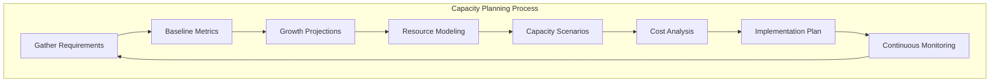

### Capacity Planning Worksheet

```markdown
## Capacity Planning Worksheet

### 1. Current State Analysis

#### Traffic Metrics

| Metric              | Current  | Peak     | 95th Percentile |
| ------------------- | -------- | -------- | --------------- |
| Requests/second     | 1,000    | 5,000    | 3,500           |
| Concurrent Users    | 10,000   | 50,000   | 35,000          |
| Data Ingestion Rate | 100 MB/s | 500 MB/s | 350 MB/s        |
| API Latency (P99)   | 200ms    | 500ms    | 300ms           |

#### Resource Utilization

| Resource    | Average | Peak   | Threshold |
| ----------- | ------- | ------ | --------- |
| CPU         | 45%     | 75%    | 70%       |
| Memory      | 60%     | 85%    | 80%       |
| Network I/O | 2 Gbps  | 8 Gbps | 10 Gbps   |
| Disk IOPS   | 10,000  | 25,000 | 30,000    |
| Storage     | 5 TB    | -      | 80%       |

### 2. Growth Projections

| Timeframe | User Growth | Traffic Growth | Data Growth |
| --------- | ----------- | -------------- | ----------- |
| 6 months  | +50%        | +75%           | +100%       |
| 12 months | +100%       | +150%          | +200%       |
| 24 months | +200%       | +300%          | +400%       |

### 3. Capacity Requirements

#### Compute Capacity

| Scenario      | Instances | Type        | vCPU Total | Memory Total |
| ------------- | --------- | ----------- | ---------- | ------------ |
| Current       | 10        | m6i.xlarge  | 40         | 160 GB       |
| 6 months      | 15        | m6i.xlarge  | 60         | 240 GB       |
| 12 months     | 20        | m6i.2xlarge | 160        | 640 GB       |
| Peak + Buffer | 30        | m6i.2xlarge | 240        | 960 GB       |

#### Database Capacity

| Scenario  | Instance       | Storage | IOPS   | Connections |
| --------- | -------------- | ------- | ------ | ----------- |
| Current   | db.r6g.xlarge  | 500 GB  | 12,000 | 500         |
| 6 months  | db.r6g.2xlarge | 1 TB    | 20,000 | 800         |
| 12 months | db.r6g.4xlarge | 2 TB    | 40,000 | 1,500       |

#### Storage Capacity

| Type       | Current | 6 months | 12 months | 24 months |
| ---------- | ------- | -------- | --------- | --------- |
| Hot (SSD)  | 2 TB    | 4 TB     | 8 TB      | 16 TB     |
| Warm (HDD) | 10 TB   | 20 TB    | 40 TB     | 80 TB     |
| Archive    | 50 TB   | 100 TB   | 200 TB    | 400 TB    |

### 4. Cost Projection

| Category  | Current/mo  | 6 months    | 12 months   | 24 months   |
| --------- | ----------- | ----------- | ----------- | ----------- |
| Compute   | $5,000      | $7,500      | $15,000     | $25,000     |
| Database  | $3,000      | $5,000      | $10,000     | $18,000     |
| Storage   | $2,000      | $4,000      | $8,000      | $15,000     |
| Network   | $1,500      | $2,500      | $5,000      | $10,000     |
| **Total** | **$11,500** | **$19,000** | **$38,000** | **$68,000** |
```

### Capacity Monitoring Configuration

```hcl
module "capacity_monitoring" {
  source = "./modules/monitoring"

  # CloudWatch Dashboards
  dashboards = {
    capacity = {
      widgets = [
        {
          type   = "metric"
          title  = "CPU Utilization Trend"
          metrics = [
            ["AWS/EC2", "CPUUtilization", "AutoScalingGroupName", "prod-asg"]
          ]
          period = 3600
          stat   = "Average"
        },
        {
          type   = "metric"
          title  = "Memory Utilization"
          metrics = [
            ["CWAgent", "mem_used_percent", "AutoScalingGroupName", "prod-asg"]
          ]
          period = 3600
          stat   = "Average"
        },
        {
          type   = "metric"
          title  = "Database Connections"
          metrics = [
            ["AWS/RDS", "DatabaseConnections", "DBInstanceIdentifier", "prod-db"]
          ]
          period = 300
          stat   = "Maximum"
        },
        {
          type   = "metric"
          title  = "Storage Utilization"
          metrics = [
            ["AWS/RDS", "FreeStorageSpace", "DBInstanceIdentifier", "prod-db"]
          ]
          period = 3600
          stat   = "Average"
        }
      ]
    }
  }

  # Capacity Alerts
  alarms = {
    cpu_high = {
      metric_name         = "CPUUtilization"
      namespace           = "AWS/EC2"
      comparison_operator = "GreaterThanThreshold"
      threshold           = 70
      evaluation_periods  = 3
      period              = 300
      statistic           = "Average"
      alarm_actions       = [aws_sns_topic.alerts.arn]
    }

    memory_high = {
      metric_name         = "mem_used_percent"
      namespace           = "CWAgent"
      comparison_operator = "GreaterThanThreshold"
      threshold           = 80
      evaluation_periods  = 3
      period              = 300
      statistic           = "Average"
      alarm_actions       = [aws_sns_topic.alerts.arn]
    }

    db_connections_high = {
      metric_name         = "DatabaseConnections"
      namespace           = "AWS/RDS"
      comparison_operator = "GreaterThanThreshold"
      threshold           = 400  # 80% of max
      evaluation_periods  = 2
      period              = 300
      statistic           = "Maximum"
      alarm_actions       = [aws_sns_topic.alerts.arn]
    }

    storage_low = {
      metric_name         = "FreeStorageSpace"
      namespace           = "AWS/RDS"
      comparison_operator = "LessThanThreshold"
      threshold           = 107374182400  # 100 GB
      evaluation_periods  = 1
      period              = 3600
      statistic           = "Average"
      alarm_actions       = [aws_sns_topic.alerts.arn]
    }
  }

  # Capacity Forecasting
  anomaly_detection = {
    enabled = true
    metrics = [
      {
        metric_name = "CPUUtilization"
        namespace   = "AWS/EC2"
        band_width  = 2
      },
      {
        metric_name = "DatabaseConnections"
        namespace   = "AWS/RDS"
        band_width  = 2
      }
    ]
  }
}
```

---

## 9. Performance SLAs and Monitoring

### SLA Definition Framework

| Tier         | Availability | Response Time (P99) | Throughput | Error Rate | Support Response |
| ------------ | ------------ | ------------------- | ---------- | ---------- | ---------------- |
| **Platinum** | 99.99%       | < 100ms             | 10,000 RPS | < 0.01%    | 15 min           |
| **Gold**     | 99.95%       | < 200ms             | 5,000 RPS  | < 0.1%     | 1 hour           |
| **Silver**   | 99.9%        | < 500ms             | 1,000 RPS  | < 0.5%     | 4 hours          |
| **Bronze**   | 99.5%        | < 1000ms            | 500 RPS    | < 1%       | 24 hours         |

### SLI/SLO/SLA Definitions

```yaml
# slo-definitions.yaml
service: api-gateway
owner: platform-team
tier: gold

slis:
  availability:
    description: "Percentage of successful requests"
    query: |
      sum(rate(http_requests_total{status!~"5.."}[5m])) /
      sum(rate(http_requests_total[5m])) * 100
    unit: percent

  latency_p99:
    description: "99th percentile response time"
    query: |
      histogram_quantile(0.99, sum(rate(http_request_duration_seconds_bucket[5m])) by (le))
    unit: seconds

  throughput:
    description: "Requests per second"
    query: |
      sum(rate(http_requests_total[5m]))
    unit: requests/second

  error_rate:
    description: "Percentage of 5xx errors"
    query: |
      sum(rate(http_requests_total{status=~"5.."}[5m])) /
      sum(rate(http_requests_total[5m])) * 100
    unit: percent

slos:
  availability:
    target: 99.95
    window: 30d
    alerting:
      burn_rate_alerts:
        - severity: critical
          burn_rate: 14.4
          window: 1h
        - severity: warning
          burn_rate: 6
          window: 6h

  latency_p99:
    target: 0.2 # 200ms
    window: 30d
    alerting:
      threshold_alerts:
        - severity: warning
          threshold: 0.15 # 150ms - early warning
        - severity: critical
          threshold: 0.2 # 200ms - SLO breach

  error_rate:
    target: 0.1 # 0.1%
    window: 30d
    alerting:
      burn_rate_alerts:
        - severity: critical
          burn_rate: 10
          window: 1h

error_budget:
  monthly_budget_percent: 0.05 # 99.95% availability = 0.05% budget
  alerting:
    - remaining: 50%
      severity: warning
    - remaining: 25%
      severity: critical
    - remaining: 0%
      severity: page
```

### Comprehensive Monitoring Stack

```hcl
module "observability" {
  source = "./modules/observability"

  # Prometheus Configuration
  prometheus = {
    enabled          = true
    retention_days   = 30
    storage_size_gb  = 500

    scrape_configs = [
      {
        job_name        = "kubernetes-pods"
        scrape_interval = "15s"
        kubernetes_sd_config = {
          role = "pod"
        }
      },
      {
        job_name        = "kubernetes-services"
        scrape_interval = "30s"
        kubernetes_sd_config = {
          role = "service"
        }
      }
    ]

    alerting_rules = file("${path.module}/alerts/prometheus-rules.yaml")
  }

  # Grafana Configuration
  grafana = {
    enabled = true

    datasources = [
      {
        name      = "Prometheus"
        type      = "prometheus"
        url       = "http://prometheus:9090"
        is_default = true
      },
      {
        name = "CloudWatch"
        type = "cloudwatch"
        jsonData = {
          defaultRegion = var.aws_region
        }
      },
      {
        name = "Loki"
        type = "loki"
        url  = "http://loki:3100"
      }
    ]

    dashboards = {
      slo_overview      = file("${path.module}/dashboards/slo-overview.json")
      infrastructure    = file("${path.module}/dashboards/infrastructure.json")
      application       = file("${path.module}/dashboards/application.json")
      cost_analysis     = file("${path.module}/dashboards/cost.json")
    }
  }

  # Distributed Tracing
  tracing = {
    enabled = true

    jaeger = {
      collector_replicas = 3
      query_replicas     = 2
      storage_type       = "elasticsearch"
      retention_days     = 7
    }

    sampling = {
      type = "probabilistic"
      param = 0.1  # 10% sampling
    }
  }

  # Log Aggregation
  logging = {
    enabled = true

    loki = {
      retention_days = 30
      storage_type   = "s3"
      s3_bucket     = aws_s3_bucket.logs.id
    }

    promtail = {
      enabled = true
      scrape_configs = [
        {
          job_name   = "kubernetes"
          kubernetes = true
        }
      ]
    }
  }

  # Alertmanager Configuration
  alertmanager = {
    enabled = true

    routes = [
      {
        match = { severity = "critical" }
        receiver = "pagerduty-critical"
        repeat_interval = "5m"
      },
      {
        match = { severity = "warning" }
        receiver = "slack-warnings"
        repeat_interval = "1h"
      }
    ]

    receivers = [
      {
        name = "pagerduty-critical"
        pagerduty_configs = [{
          service_key = var.pagerduty_service_key
          severity    = "critical"
        }]
      },
      {
        name = "slack-warnings"
        slack_configs = [{
          api_url = var.slack_webhook_url
          channel = "#alerts"
        }]
      }
    ]

    inhibit_rules = [
      {
        source_match  = { severity = "critical" }
        target_match  = { severity = "warning" }
        equal         = ["alertname", "namespace"]
      }
    ]
  }

  # Synthetic Monitoring
  synthetics = {
    enabled = true

    canaries = [
      {
        name     = "api-health"
        schedule = "rate(1 minute)"
        runtime  = "syn-nodejs-puppeteer-6.2"
        handler  = "apiCanary.handler"
        script   = file("${path.module}/canaries/api-health.js")

        endpoints = [
          { url = "https://api.example.com/health", method = "GET" },
          { url = "https://api.example.com/v1/status", method = "GET" }
        ]

        success_retention_period = 31
        failure_retention_period = 93
      }
    ]
  }
}
```

---

## 10. Migration and Modernization Strategies

### Migration Strategy Decision Tree

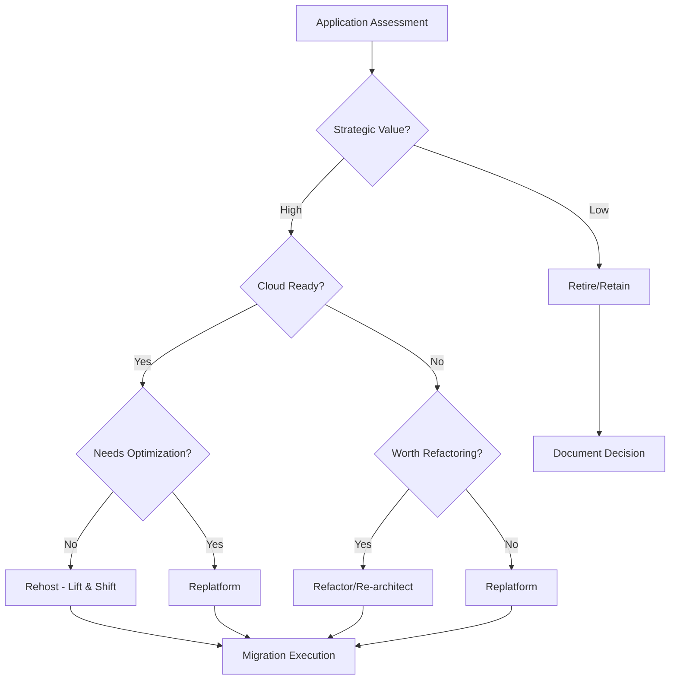

### 6 R's Migration Framework

| Strategy       | Description       | Complexity | Timeframe   | Cost     | Best For                      |
| -------------- | ----------------- | ---------- | ----------- | -------- | ----------------------------- |
| **Rehost**     | Lift and shift    | Low        | 1-4 weeks   | Low      | Urgent migration, stable apps |
| **Replatform** | Lift and reshape  | Medium     | 4-12 weeks  | Medium   | Quick wins, managed services  |
| **Repurchase** | Replace with SaaS | Low        | 2-8 weeks   | Variable | Commodity software            |
| **Refactor**   | Re-architect      | High       | 3-12 months | High     | Strategic applications        |
| **Retain**     | Keep on-premises  | None       | N/A         | Ongoing  | Compliance, recent investment |
| **Retire**     | Decommission      | Low        | 2-4 weeks   | Savings  | Redundant applications        |

### Migration Assessment Template

````markdown
## Application Migration Assessment

### Application Profile

| Attribute            | Value                      |
| -------------------- | -------------------------- |
| Name                 | Order Management System    |
| Business Criticality | High                       |
| Current Environment  | On-premises VMware         |
| Architecture         | 3-tier monolith            |
| Tech Stack           | Java 11, Oracle DB, Apache |
| Users                | 500 internal               |
| Data Size            | 2 TB                       |
| Dependencies         | ERP, CRM, Payment Gateway  |

### Technical Assessment

#### Compatibility Score (1-5)

| Category               | Score   | Notes                                 |
| ---------------------- | ------- | ------------------------------------- |
| Compute Compatibility  | 4       | Standard Java app                     |
| Database Compatibility | 3       | Oracle to PostgreSQL migration needed |
| Network Requirements   | 4       | Standard HTTP/HTTPS                   |
| Storage Requirements   | 5       | File storage to S3                    |
| Security Requirements  | 3       | IAM integration required              |
| **Overall**            | **3.8** |                                       |

#### Migration Complexity

| Factor                    | Assessment                     |
| ------------------------- | ------------------------------ |
| Code Changes Required     | Moderate - DB layer            |
| Data Migration Complexity | High - 2TB with transformation |
| Integration Changes       | Low - API-based                |
| Testing Requirements      | High - Critical system         |
| Rollback Capability       | Medium                         |

### Recommended Strategy: Replatform

#### Rationale

- Move to managed services (RDS PostgreSQL, ALB)
- Minimal code changes
- Improved scalability and availability
- Reduced operational overhead

#### Target Architecture

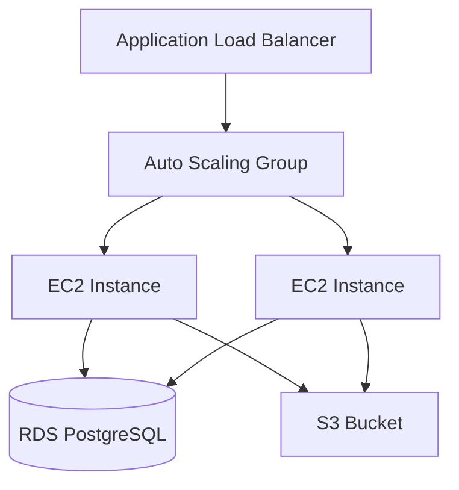
````

#### Migration Plan

| Phase                 | Duration | Activities                                 |
| --------------------- | -------- | ------------------------------------------ |
| Preparation           | 2 weeks  | Setup AWS accounts, networking, security   |
| Database Migration    | 3 weeks  | Schema conversion, data migration, testing |
| Application Migration | 2 weeks  | Deploy app, configure ALB, testing         |
| Cutover               | 1 week   | DNS switch, monitoring, validation         |
| Optimization          | 2 weeks  | Performance tuning, cost optimization      |

#### Risk Mitigation

| Risk                       | Probability | Impact | Mitigation                           |
| -------------------------- | ----------- | ------ | ------------------------------------ |
| Data loss during migration | Low         | High   | Multiple backups, validation scripts |
| Extended downtime          | Medium      | High   | Parallel run, quick rollback plan    |
| Performance degradation    | Medium      | Medium | Load testing, right-sizing           |
| Integration failures       | Low         | Medium | API testing, staged rollout          |

````

### Migration Terraform Module

```hcl
module "migration" {
  source = "./modules/migration"

  # Source Environment
  source_environment = {
    type        = "vmware"
    vcenter_url = var.vcenter_url
    datacenter  = "DC1"
  }

  # Migration Strategy
  strategy = "replatform"

  # Application Configuration
  application = {
    name        = "order-management"
    environment = "production"

    compute = {
      instance_type = "m6i.xlarge"
      min_size      = 2
      max_size      = 10
      ami_id        = data.aws_ami.application.id
    }

    database = {
      engine         = "postgres"
      engine_version = "15.4"
      instance_class = "db.r6g.xlarge"
      storage_gb     = 500
      multi_az       = true

      migration = {
        source_engine     = "oracle"
        schema_conversion = true
        dms_instance_class = "dms.r5.xlarge"
      }
    }

    storage = {
      type = "s3"
      migration = {
        source_type = "nfs"
        source_path = "/data/files"
        sync_method = "datasync"
      }
    }
  }

  # Migration Windows
  migration_windows = {
    database = {
      start     = "2024-03-01T22:00:00Z"
      duration  = "8h"
      blackout_dates = ["2024-03-15", "2024-03-31"]
    }
    application = {
      start     = "2024-03-08T22:00:00Z"
      duration  = "4h"
    }
    cutover = {
      start     = "2024-03-15T22:00:00Z"
      duration  = "2h"
    }
  }

  # Validation
  validation = {
    enabled = true
    checks = [
      {
        name    = "database_row_count"
        type    = "sql"
        source  = "SELECT COUNT(*) FROM orders"
        target  = "SELECT COUNT(*) FROM orders"
        tolerance = 0
      },
      {
        name    = "api_health"
        type    = "http"
        url     = "https://api.example.com/health"
        expected_status = 200
      },
      {
        name    = "performance_baseline"
        type    = "load_test"
        script  = file("${path.module}/tests/load_test.js")
        threshold_p99_ms = 200
      }
    ]
  }

  # Rollback Configuration
  rollback = {
    enabled = true
    automatic_trigger = {
      error_rate_threshold = 5  # percent
      latency_threshold_ms = 500
      evaluation_period_minutes = 5
    }
    dns_ttl = 60
  }
}
````

### Modernization Patterns

```hcl
# Strangler Fig Pattern Implementation
module "strangler_fig" {
  source = "./modules/strangler-fig"

  # Legacy Application
  legacy = {
    url           = "https://legacy.internal.example.com"
    health_check  = "/health"
  }

  # Modern Services
  modern_services = {
    user_service = {
      url           = "https://users.internal.example.com"
      routes        = ["/api/v2/users/*", "/api/v2/auth/*"]
      health_check  = "/health"
    }
    order_service = {
      url           = "https://orders.internal.example.com"
      routes        = ["/api/v2/orders/*"]
      health_check  = "/health"
    }
    # Remaining routes go to legacy
  }

  # Traffic Routing
  routing = {
    type = "path_based"  # path_based | header_based | percentage

    # Gradual rollout configuration
    canary = {
      enabled     = true
      percentage  = 10
      routes      = ["/api/v2/orders/*"]
    }
  }

  # Feature Flags
  feature_flags = {
    provider = "launchdarkly"
    project  = "migration"
    flags = {
      use_new_user_service  = { default = false }
      use_new_order_service = { default = false }
    }
  }
}
```

---

## Integration with Other Agents

### Cloud Expert Integration

```bash
# AWS-specific implementation
/agents/cloud/aws-expert design EKS cluster with Fargate and spot instances

# GCP-specific implementation
/agents/cloud/gcp-expert set up GKE Autopilot with Workload Identity

# Azure-specific implementation
/agents/cloud/azure-expert configure AKS with Azure AD and AGIC

# Multi-cloud strategy
/agents/cloud/multi-cloud-architect design active-active deployment across AWS and GCP
```

### DevOps Tool Integration

```bash
# Kubernetes deployment
/agents/devops/kubernetes-expert create production-ready Helm chart

# Terraform modules
/agents/devops/terraform-expert create reusable VPC module with security best practices

# CI/CD pipelines
/agents/devops/ci-cd-expert design GitOps workflow with ArgoCD

# Monitoring setup
/agents/devops/monitoring-expert configure Prometheus and Grafana for SLO monitoring
```

### Security Expert Integration

```bash
# Security architecture review
/agents/security/security-expert audit VPC design for zero-trust compliance

# IAM policy review
/agents/security/security-expert review IAM roles for least privilege

# Compliance assessment
/agents/security/compliance-expert assess infrastructure for SOC2 compliance
```

---

## Quick Reference Commands

```bash
# Design new infrastructure
/agents/devops/infrastructure-architect design highly available e-commerce platform on AWS

# Review existing architecture
/agents/devops/infrastructure-architect review current infrastructure for cost optimization

# Create DR plan
/agents/devops/infrastructure-architect design disaster recovery plan with RTO 15min RPO 5min

# Security architecture
/agents/devops/infrastructure-architect design zero-trust network architecture

# Multi-cloud design
/agents/devops/infrastructure-architect design multi-cloud strategy for vendor lock-in mitigation

# Cost estimation
/agents/devops/infrastructure-architect estimate costs for production Kubernetes cluster

# Capacity planning
/agents/devops/infrastructure-architect create capacity plan for 10x growth over 2 years

# Migration planning
/agents/devops/infrastructure-architect plan migration of monolith to microservices on Kubernetes

# SLA design
/agents/devops/infrastructure-architect define SLIs SLOs and SLAs for API platform

# Auto-scaling strategy
/agents/devops/infrastructure-architect design predictive auto-scaling for variable workloads
```

---

## Checklists

### Pre-Design Checklist

- [ ] Business requirements documented
- [ ] SLAs defined (availability, latency, throughput)
- [ ] Budget constraints established
- [ ] Compliance requirements identified (SOC2, HIPAA, PCI-DSS, GDPR)
- [ ] Existing infrastructure inventory complete
- [ ] Growth projections documented
- [ ] Security requirements defined
- [ ] Stakeholder sign-off obtained

### Architecture Review Checklist

- [ ] Multi-AZ/region deployment for HA
- [ ] Auto-scaling configured appropriately
- [ ] Load balancing strategy defined
- [ ] VPC/network segmentation complete
- [ ] IAM least privilege verified
- [ ] Encryption at rest and in transit
- [ ] Backup and DR strategy documented
- [ ] Monitoring and alerting configured
- [ ] Cost optimization measures applied
- [ ] IaC modules versioned and tested
- [ ] Capacity planning documented
- [ ] Migration runbooks created

### Security Review Checklist

- [ ] No public S3 buckets (unless intended)
- [ ] No overly permissive security groups
- [ ] No hardcoded credentials in IaC
- [ ] KMS keys with proper rotation
- [ ] VPC flow logs enabled
- [ ] CloudTrail/audit logging enabled
- [ ] WAF rules configured
- [ ] DDoS protection enabled
- [ ] Secrets in Secrets Manager/Vault
- [ ] Zero-trust principles applied
- [ ] Network segmentation verified
- [ ] Compliance controls implemented

### Migration Checklist

- [ ] Application assessment complete
- [ ] Migration strategy selected
- [ ] Target architecture designed
- [ ] Migration timeline defined
- [ ] Rollback plan documented
- [ ] Testing plan created
- [ ] Stakeholder communication plan
- [ ] Cutover runbook prepared
- [ ] Validation criteria defined
- [ ] Post-migration optimization planned

---

_Infrastructure Architect Agent v3.0.0 | Author: Ahmed Adel Bakr Alderai_
