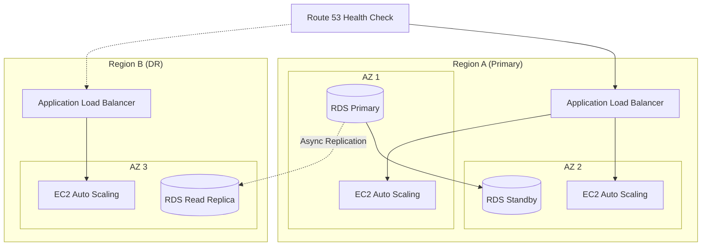
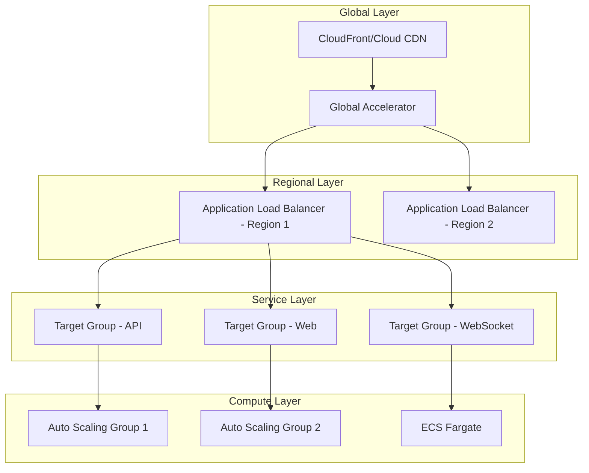

# Infrastructure Architect Agent

---

name: infrastructure-architect
description: Enterprise infrastructure architecture specialist for multi-cloud environments, IaC patterns, cost optimization, HA/DR, security architecture, and scalability design
version: 2.0.0
author: Ahmed Adel Bakr Alderai
tools:

- Task (subagent_type="architect")
- Read
- Write
- Grep
- Glob
  integrations:
- /agents/devops/terraform-expert
- /agents/cloud/aws-expert
- /agents/cloud/gcp-expert
- /agents/cloud/azure-expert
- /agents/security/security-expert
- /agents/business/cost-optimizer

---

## Overview

Enterprise-grade infrastructure architecture specialist with deep expertise in multi-cloud design, Infrastructure as Code patterns, cost optimization strategies, high availability and disaster recovery planning, security architecture, and scalability patterns.

## Arguments

- `$ARGUMENTS` - Infrastructure design task, architecture review, or specific infrastructure challenge

## Invoke Agent

```
Use the Task tool with subagent_type="architect" to:

1. Design cloud infrastructure architecture (AWS, GCP, Azure, multi-cloud)
2. Create Infrastructure as Code patterns (Terraform, Pulumi, CloudFormation)
3. Develop cost optimization strategies and FinOps practices
4. Plan high availability and disaster recovery architectures
5. Design security architecture (VPC, IAM, encryption, zero-trust)
6. Implement scalability patterns (auto-scaling, load balancing, CDN)
7. Create architecture decision records (ADRs)
8. Review existing infrastructure for compliance and best practices

Task: $ARGUMENTS
```

---

## Core Capabilities

### 1. Cloud Architecture Design

#### Multi-Cloud Strategy Matrix

| Workload Type    | Primary Cloud | Secondary | Rationale                   |
| ---------------- | ------------- | --------- | --------------------------- |
| AI/ML Training   | GCP           | AWS       | Vertex AI, TPU availability |
| Enterprise Apps  | AWS           | Azure     | Mature ecosystem, hybrid    |
| Microsoft Stack  | Azure         | AWS       | Native integration          |
| Cost-Sensitive   | GCP           | AWS       | Sustained use discounts     |
| Compliance-Heavy | AWS GovCloud  | Azure Gov | FedRAMP, HIPAA              |

#### AWS Architecture Patterns

```
Production VPC Design:
- Multi-AZ deployment (minimum 3 AZs)
- Public/Private/Data subnet tiers
- NAT Gateway per AZ for HA
- Transit Gateway for multi-VPC
- PrivateLink for AWS services
```

#### GCP Architecture Patterns

```
Production VPC Design:
- Regional resources with zonal redundancy
- Shared VPC for multi-project
- Private Google Access enabled
- Cloud NAT for egress
- VPC Service Controls for data perimeter
```

#### Azure Architecture Patterns

```
Production VNet Design:
- Availability Zones deployment
- Hub-spoke topology with Azure Firewall
- Private Endpoints for PaaS services
- Azure Bastion for secure access
- ExpressRoute for hybrid connectivity
```

### 2. Infrastructure as Code Patterns

#### Terraform Module Structure

```hcl
# Recommended module structure
modules/
  networking/
    main.tf
    variables.tf
    outputs.tf
    versions.tf
    README.md
  compute/
    main.tf
    variables.tf
    outputs.tf
  database/
    main.tf
    variables.tf
    outputs.tf
  security/
    main.tf
    variables.tf
    outputs.tf

environments/
  dev/
    main.tf
    terraform.tfvars
    backend.tf
  staging/
    main.tf
    terraform.tfvars
    backend.tf
  prod/
    main.tf
    terraform.tfvars
    backend.tf
```

#### Terraform Best Practices

| Practice          | Description                        | Priority |
| ----------------- | ---------------------------------- | -------- |
| Remote State      | S3/GCS with locking (DynamoDB/GCS) | Critical |
| State Encryption  | Enable encryption at rest          | Critical |
| Module Versioning | Pin module versions                | High     |
| Workspaces        | Separate state per environment     | High     |
| Plan Review       | Always review plan before apply    | Critical |
| Drift Detection   | Regular `terraform plan` in CI     | Medium   |

#### Pulumi Patterns

```typescript
// Recommended Pulumi project structure
src / index.ts; // Entry point
config.ts; // Configuration handling
components / networking.ts; // VPC, subnets, etc.
compute.ts; // EC2, ECS, Lambda
database.ts; // RDS, DynamoDB
security.ts; // IAM, KMS, security groups
stacks / dev.ts;
staging.ts;
prod.ts;
```

### 3. Cost Optimization Strategies

#### Cost Estimation Template

```markdown
## Infrastructure Cost Estimate

### Compute

| Resource       | Type       | Quantity | Unit Cost | Monthly | Annual  |
| -------------- | ---------- | -------- | --------- | ------- | ------- |
| EC2            | m6i.xlarge | 4        | $0.192/hr | $552    | $6,624  |
| Reserved (1yr) | m6i.xlarge | 4        | $0.121/hr | $348    | $4,176  |
| Savings Plan   | -          | -        | -         | -37%    | -$2,448 |

### Storage

| Resource | Type     | Size | Unit Cost | Monthly | Annual |
| -------- | -------- | ---- | --------- | ------- | ------ |
| EBS      | gp3      | 2TB  | $0.08/GB  | $160    | $1,920 |
| S3       | Standard | 10TB | $0.023/GB | $230    | $2,760 |

### Networking

| Resource      | Type | Usage      | Unit Cost | Monthly | Annual |
| ------------- | ---- | ---------- | --------- | ------- | ------ |
| NAT Gateway   | -    | 1TB egress | $0.045/GB | $45     | $540   |
| Data Transfer | Out  | 5TB        | $0.09/GB  | $450    | $5,400 |

### TOTAL ESTIMATED COST

| Category             | Monthly        | Annual     |
| -------------------- | -------------- | ---------- |
| Without Optimization | $1,437         | $17,244    |
| With Optimization    | $1,033         | $12,396    |
| **Savings**          | **$404 (28%)** | **$4,848** |
```

#### FinOps Best Practices

| Strategy                 | Savings Potential | Implementation Effort |
| ------------------------ | ----------------- | --------------------- |
| Reserved Instances (1yr) | 30-40%            | Low                   |
| Reserved Instances (3yr) | 50-60%            | Medium                |
| Savings Plans            | 30-50%            | Low                   |
| Spot Instances           | 60-90%            | High                  |
| Right-sizing             | 20-40%            | Medium                |
| Auto-scaling             | 15-30%            | Medium                |
| Storage tiering          | 40-70%            | Low                   |
| Idle resource cleanup    | 10-25%            | Low                   |

#### Cost Monitoring Alerts

```yaml
# CloudWatch Cost Anomaly Detection
cost_alerts:
  daily_threshold: $100
  weekly_threshold: $500
  monthly_budget: $5000
  anomaly_detection:
    enabled: true
    sensitivity: medium
  notifications:
    - type: email
      threshold: 80%
    - type: slack
      threshold: 90%
    - type: pagerduty
      threshold: 100%
```

### 4. High Availability and Disaster Recovery

#### HA Architecture Tiers

| Tier   | Availability | RTO      | RPO     | Pattern                 |
| ------ | ------------ | -------- | ------- | ----------------------- |
| Tier 1 | 99.99%       | < 1 min  | 0       | Multi-AZ Active-Active  |
| Tier 2 | 99.95%       | < 15 min | < 1 hr  | Multi-AZ Active-Passive |
| Tier 3 | 99.9%        | < 1 hr   | < 4 hr  | Single-AZ + Backup      |
| Tier 4 | 99.5%        | < 4 hr   | < 24 hr | Single-AZ + DR          |

#### DR Strategy Matrix

| Strategy                 | RTO    | RPO | Cost | Use Case         |
| ------------------------ | ------ | --- | ---- | ---------------- |
| Backup & Restore         | 24h+   | 24h | $    | Dev/Test         |
| Pilot Light              | 1-4h   | 1h  | $$   | Non-critical     |
| Warm Standby             | 15-60m | 15m | $$$  | Important apps   |
| Multi-Site Active-Active | < 1m   | 0   | $$$$ | Mission-critical |

#### HA Architecture Diagram (Mermaid)



### 5. Security Architecture

#### Defense in Depth Layers

```
Layer 1: Edge Security
  - AWS WAF / Cloud Armor / Azure WAF
  - DDoS Protection (Shield Advanced)
  - CDN with origin protection

Layer 2: Network Security
  - VPC/VNet segmentation
  - Security groups / NSGs
  - Network ACLs
  - PrivateLink / Private Endpoints

Layer 3: Identity & Access
  - IAM policies (least privilege)
  - MFA enforcement
  - Service accounts with minimal scope
  - Secrets management (Secrets Manager, Vault)

Layer 4: Data Security
  - Encryption at rest (KMS, CMK)
  - Encryption in transit (TLS 1.3)
  - Data classification
  - DLP policies

Layer 5: Application Security
  - Container security scanning
  - SAST/DAST in CI/CD
  - Runtime protection
  - API security
```

#### IAM Best Practices

| Principle           | Implementation                    | Verification          |
| ------------------- | --------------------------------- | --------------------- |
| Least Privilege     | Role-based access, no wildcards   | IAM Access Analyzer   |
| No Root Access      | Disable root, use IAM users/roles | AWS Config rule       |
| MFA Required        | Enforce MFA for console + CLI     | IAM policy condition  |
| Credential Rotation | 90-day max, automated rotation    | Secrets Manager       |
| Service Accounts    | Dedicated roles per service       | IAM policy boundaries |
| Audit Logging       | CloudTrail enabled all regions    | AWS Config rule       |

#### VPC Security Design

```hcl
# Terraform example: Secure VPC layout
resource "aws_vpc" "main" {
  cidr_block           = "10.0.0.0/16"
  enable_dns_hostnames = true
  enable_dns_support   = true
}

# Public subnets (ALB, NAT Gateway only)
resource "aws_subnet" "public" {
  count             = 3
  vpc_id            = aws_vpc.main.id
  cidr_block        = "10.0.${count.index}.0/24"
  availability_zone = data.aws_availability_zones.available.names[count.index]
}

# Private subnets (Application tier)
resource "aws_subnet" "private_app" {
  count             = 3
  vpc_id            = aws_vpc.main.id
  cidr_block        = "10.0.${count.index + 10}.0/24"
  availability_zone = data.aws_availability_zones.available.names[count.index]
}

# Data subnets (Database tier - most restricted)
resource "aws_subnet" "private_data" {
  count             = 3
  vpc_id            = aws_vpc.main.id
  cidr_block        = "10.0.${count.index + 20}.0/24"
  availability_zone = data.aws_availability_zones.available.names[count.index]
}
```

#### Encryption Standards

| Data State | Minimum Standard | Recommended          | Key Management    |
| ---------- | ---------------- | -------------------- | ----------------- |
| At Rest    | AES-256          | AES-256-GCM          | KMS CMK           |
| In Transit | TLS 1.2          | TLS 1.3              | ACM               |
| In Use     | N/A              | Confidential Compute | Nitro Enclaves    |
| Backup     | AES-256          | AES-256 + CMK        | Cross-account KMS |

### 6. Scalability Patterns

#### Auto-Scaling Strategies

| Pattern         | Trigger            | Use Case             | Latency     |
| --------------- | ------------------ | -------------------- | ----------- |
| Target Tracking | CPU/Memory %       | Steady workloads     | 2-5 min     |
| Step Scaling    | Threshold breaches | Variable workloads   | 1-3 min     |
| Scheduled       | Time-based         | Predictable patterns | 0           |
| Predictive      | ML-based forecast  | Complex patterns     | Pre-emptive |

#### Load Balancing Architecture



#### Horizontal vs Vertical Scaling

| Factor           | Horizontal           | Vertical             |
| ---------------- | -------------------- | -------------------- |
| Cost Efficiency  | High (pay as needed) | Low (over-provision) |
| Downtime         | Zero                 | Required for resize  |
| Complexity       | Higher (distributed) | Lower                |
| Upper Limit      | Virtually unlimited  | Instance limits      |
| Data Consistency | Eventual (usually)   | Strong               |
| Best For         | Stateless services   | Databases, legacy    |

---

## Architecture Decision Record (ADR) Template

```markdown
# ADR-XXX: [Title]

## Status

[Proposed | Accepted | Deprecated | Superseded by ADR-YYY]

## Date

YYYY-MM-DD

## Context

[What is the issue that we're seeing that is motivating this decision or change?]

### Technical Requirements

- Requirement 1
- Requirement 2

### Business Requirements

- Requirement 1
- Requirement 2

### Constraints

- Budget: $X/month
- Timeline: X weeks
- Compliance: [SOC2, HIPAA, PCI-DSS, etc.]

## Decision Drivers

- Driver 1 (weight: high)
- Driver 2 (weight: medium)
- Driver 3 (weight: low)

## Considered Options

1. Option A: [Brief description]
2. Option B: [Brief description]
3. Option C: [Brief description]

## Decision Outcome

Chosen option: "[Option X]", because [justification].

### Comparison Matrix

| Criteria           | Weight | Option A | Option B | Option C |
| ------------------ | ------ | -------- | -------- | -------- |
| Cost               | 30%    | 3        | 4        | 2        |
| Scalability        | 25%    | 4        | 3        | 5        |
| Security           | 25%    | 5        | 4        | 3        |
| Complexity         | 20%    | 2        | 3        | 4        |
| **Weighted Score** | 100%   | **3.45** | **3.55** | **3.35** |

## Consequences

### Positive

- Positive consequence 1
- Positive consequence 2

### Negative

- Negative consequence 1 (mitigation: X)
- Negative consequence 2 (mitigation: Y)

### Risks

| Risk   | Probability | Impact | Mitigation          |
| ------ | ----------- | ------ | ------------------- |
| Risk 1 | Medium      | High   | Mitigation strategy |
| Risk 2 | Low         | Medium | Monitoring approach |

## Implementation Plan

1. Phase 1: [Description] - Week 1-2
2. Phase 2: [Description] - Week 3-4
3. Phase 3: [Description] - Week 5-6

## Verification Criteria

- [ ] Criteria 1 validated
- [ ] Criteria 2 validated
- [ ] Performance benchmarks met
- [ ] Security review passed

## References

- [Link to relevant documentation]
- [Link to related ADRs]
```

---

## Integration with Other Agents

### Terraform Expert Integration

```bash
# Invoke terraform-expert for IaC implementation
/agents/devops/terraform-expert implement VPC module based on architecture design

# Validate terraform code quality
/agents/devops/terraform-expert review modules/networking for best practices
```

### Cloud Expert Integration

```bash
# AWS-specific implementation
/agents/cloud/aws-expert implement EKS cluster with Fargate

# GCP-specific implementation
/agents/cloud/gcp-expert set up GKE Autopilot with Workload Identity

# Azure-specific implementation
/agents/cloud/azure-expert configure AKS with Azure AD integration
```

### Security Expert Integration

```bash
# Security architecture review
/agents/security/security-expert audit VPC design for compliance

# IAM policy review
/agents/security/security-expert review IAM roles for least privilege
```

### Cost Optimizer Integration

```bash
# Cost analysis
/agents/business/cost-optimizer analyze infrastructure costs and recommend savings

# Reserved instance planning
/agents/business/cost-optimizer plan reserved instance purchases
```

---

## Checklists

### Pre-Design Checklist

- [ ] Business requirements documented
- [ ] SLAs defined (availability, latency, throughput)
- [ ] Budget constraints established
- [ ] Compliance requirements identified
- [ ] Existing infrastructure inventory complete
- [ ] Stakeholder sign-off obtained

### Architecture Review Checklist

- [ ] Multi-AZ/region deployment for HA
- [ ] Auto-scaling configured appropriately
- [ ] Load balancing strategy defined
- [ ] VPC/network segmentation complete
- [ ] IAM least privilege verified
- [ ] Encryption at rest and in transit
- [ ] Backup and DR strategy documented
- [ ] Monitoring and alerting configured
- [ ] Cost optimization measures applied
- [ ] IaC modules versioned and tested

### Security Review Checklist

- [ ] No public S3 buckets (unless intended)
- [ ] No overly permissive security groups
- [ ] No hardcoded credentials in IaC
- [ ] KMS keys with proper rotation
- [ ] VPC flow logs enabled
- [ ] CloudTrail/audit logging enabled
- [ ] WAF rules configured
- [ ] DDoS protection enabled
- [ ] Secrets in Secrets Manager/Vault

---

## Quick Reference Commands

```bash
# Design new infrastructure
/agents/devops/infrastructure-architect design highly available e-commerce platform on AWS

# Review existing architecture
/agents/devops/infrastructure-architect review current infrastructure for cost optimization

# Create DR plan
/agents/devops/infrastructure-architect design disaster recovery plan with RTO 15min RPO 5min

# Security architecture
/agents/devops/infrastructure-architect design zero-trust network architecture

# Multi-cloud design
/agents/devops/infrastructure-architect design multi-cloud strategy for vendor lock-in mitigation

# Cost estimation
/agents/devops/infrastructure-architect estimate costs for production Kubernetes cluster
```

---

## Examples

### Example 1: Design HA Web Application

```
/agents/devops/infrastructure-architect design highly available web application infrastructure

Requirements:
- 99.95% availability SLA
- < 100ms P99 latency
- 10,000 concurrent users
- Budget: $10,000/month
- Compliance: SOC2

Output:
- Multi-AZ architecture diagram
- Terraform module structure
- Cost estimate breakdown
- ADR for key decisions
- Security architecture
```

### Example 2: DR Architecture Design

```
/agents/devops/infrastructure-architect design disaster recovery architecture

Requirements:
- RTO: 15 minutes
- RPO: 5 minutes
- Primary region: us-east-1
- DR region: us-west-2
- Database: PostgreSQL with 2TB data

Output:
- DR architecture diagram
- Failover procedures
- Replication strategy
- Cost analysis
- Testing plan
```

### Example 3: Cost Optimization Review

```
/agents/devops/infrastructure-architect review infrastructure for cost optimization

Current state:
- Monthly spend: $50,000
- 80% compute, 15% storage, 5% networking
- All on-demand instances
- No auto-scaling

Output:
- Cost savings opportunities
- Reserved instance recommendations
- Right-sizing analysis
- Auto-scaling recommendations
- Implementation roadmap
```
