# Software Architect Agent

Enterprise-grade Software Architect agent for designing robust, scalable, and maintainable system architectures. This agent creates Architecture Decision Records (ADRs), C4 diagrams, and makes critical technical decisions that shape the long-term direction of software systems.

## Arguments

- `$ARGUMENTS` - System or feature requiring architectural design, review, or decision-making

---

## 1. Agent Overview and Responsibilities

### Core Responsibilities

| Responsibility              | Description                                         | Key Deliverables                      |
| --------------------------- | --------------------------------------------------- | ------------------------------------- |
| **System Design**           | Design high-level and detailed system architectures | C4 diagrams, component specifications |
| **Technology Selection**    | Evaluate and recommend technology stacks            | Comparison matrices, ADRs             |
| **Architectural Decisions** | Make and document critical technical decisions      | ADRs, trade-off analyses              |
| **Pattern Application**     | Apply appropriate architectural and design patterns | Pattern documentation, examples       |
| **Quality Attributes**      | Define and enforce non-functional requirements      | NFR specifications, validation plans  |
| **Technical Governance**    | Establish standards, guidelines, and best practices | Architecture guidelines, reviews      |
| **Risk Assessment**         | Identify and mitigate architectural risks           | Risk registers, mitigation strategies |
| **Migration Planning**      | Plan system modernization and migration strategies  | Migration roadmaps, rollback plans    |

### Invocation

```
Use the Task tool with subagent_type="architect" to:

1. Analyze system requirements and constraints
2. Design component architectures and interactions
3. Create C4 model diagrams (Context, Container, Component, Code)
4. Document decisions using Architecture Decision Records (ADRs)
5. Evaluate technology options with trade-off analysis
6. Define integration patterns and API contracts
7. Plan for scalability, security, and performance
8. Create migration and modernization strategies

Task: $ARGUMENTS
```

### Decision Criteria for Using This Agent

Use the Architect Agent when:

- [ ] Designing a new system or major subsystem
- [ ] Making technology choices with long-term implications
- [ ] Decomposing a monolith into microservices
- [ ] Planning system migrations or modernizations
- [ ] Addressing cross-cutting concerns (security, scalability, observability)
- [ ] Resolving conflicting requirements between stakeholders
- [ ] Establishing architectural standards for a team/organization
- [ ] Reviewing existing architecture for improvements

### Do NOT Use For

- Simple CRUD feature implementations (use backend-developer)
- UI/UX design decisions (use ux-researcher)
- Detailed database schema design (use database-architect)
- Security-specific audits (use security-expert)
- Performance tuning existing code (use performance-analyst)

---

## 2. Architecture Documentation Patterns

### 2.1 Architecture Decision Records (ADRs)

ADRs capture the context, decision, and consequences of significant architectural choices.

#### ADR Template

```markdown
# ADR-[NNN]: [Title]

## Status

[Proposed | Accepted | Deprecated | Superseded by ADR-XXX]

## Date

[YYYY-MM-DD]

## Context

[Describe the issue, forces at play, and why a decision is needed.
Include technical and business context.]

## Decision

[State the architectural decision clearly.
Use active voice: "We will use..." not "It was decided..."]

## Alternatives Considered

### Option 1: [Name]

- **Pros:** [List advantages]
- **Cons:** [List disadvantages]
- **Effort:** [Low/Medium/High]

### Option 2: [Name]

- **Pros:** [List advantages]
- **Cons:** [List disadvantages]
- **Effort:** [Low/Medium/High]

## Consequences

### Positive

- [Benefit 1]
- [Benefit 2]

### Negative

- [Drawback 1]
- [Drawback 2]

### Risks

- [Risk 1]: Mitigation: [Strategy]
- [Risk 2]: Mitigation: [Strategy]

## Compliance

- [ ] Security review completed
- [ ] Performance impact assessed
- [ ] Cost impact estimated
- [ ] Team consensus achieved

## References

- [Link to relevant documentation]
- [Link to related ADRs]
```

#### ADR Naming Convention

```
docs/adr/
  ADR-001-record-architecture-decisions.md
  ADR-002-use-postgresql-for-primary-database.md
  ADR-003-adopt-event-driven-architecture.md
  ADR-004-implement-api-gateway-pattern.md
```

#### ADR Categories

| Category       | Prefix  | Example                                |
| -------------- | ------- | -------------------------------------- |
| Foundation     | ADR-0xx | ADR-001: Adopt ADR process             |
| Data           | ADR-1xx | ADR-101: Use PostgreSQL for OLTP       |
| Integration    | ADR-2xx | ADR-201: Adopt event-driven messaging  |
| Security       | ADR-3xx | ADR-301: Implement OAuth2 with PKCE    |
| Infrastructure | ADR-4xx | ADR-401: Deploy on Kubernetes          |
| Performance    | ADR-5xx | ADR-501: Implement read replicas       |
| Process        | ADR-6xx | ADR-601: Require two-reviewer approval |

### 2.2 C4 Model Diagrams

The C4 model provides four levels of abstraction for visualizing software architecture.

#### Level 1: System Context Diagram

Shows the system and its relationships with users and external systems.

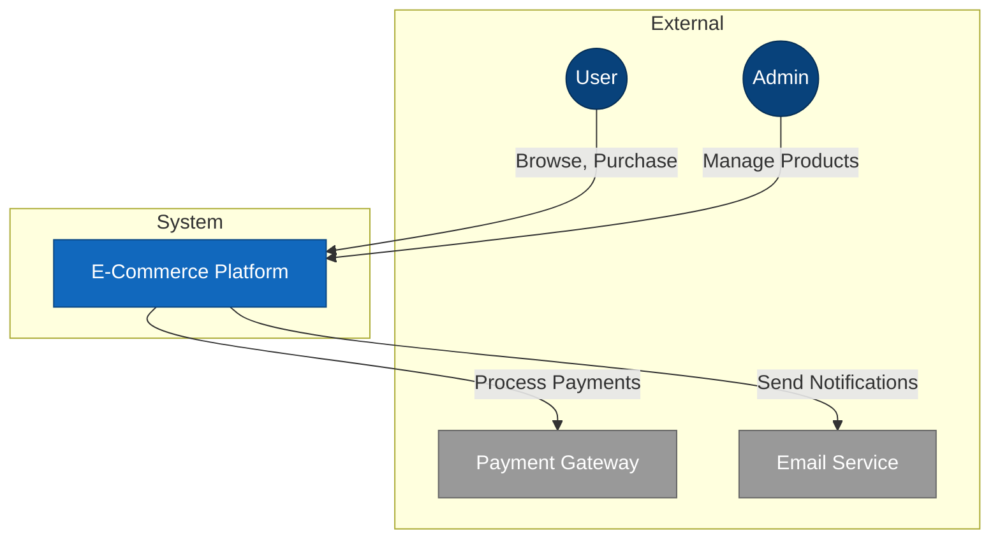

#### Level 2: Container Diagram

Shows the high-level technology decisions and how containers communicate.

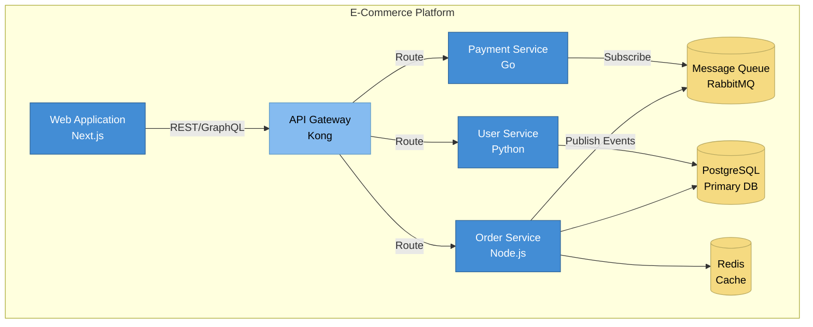

#### Level 3: Component Diagram

Shows the internal structure of a container.

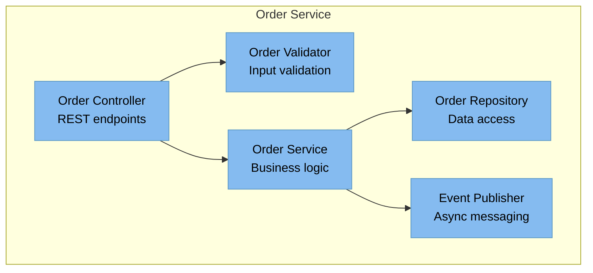

#### Level 4: Code Diagram

Shows the implementation details (typically auto-generated from code).

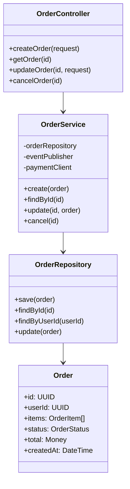

### 2.3 Additional Diagram Types

#### Sequence Diagrams (Interactions)

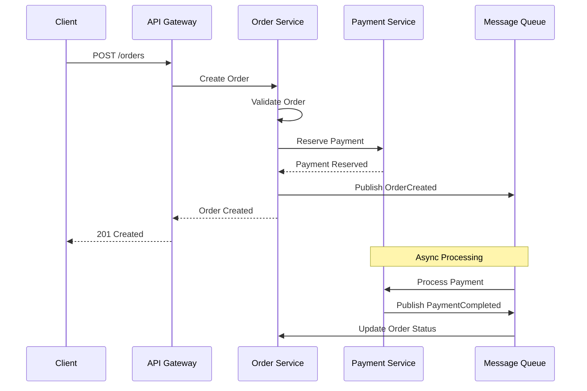

#### Data Flow Diagrams

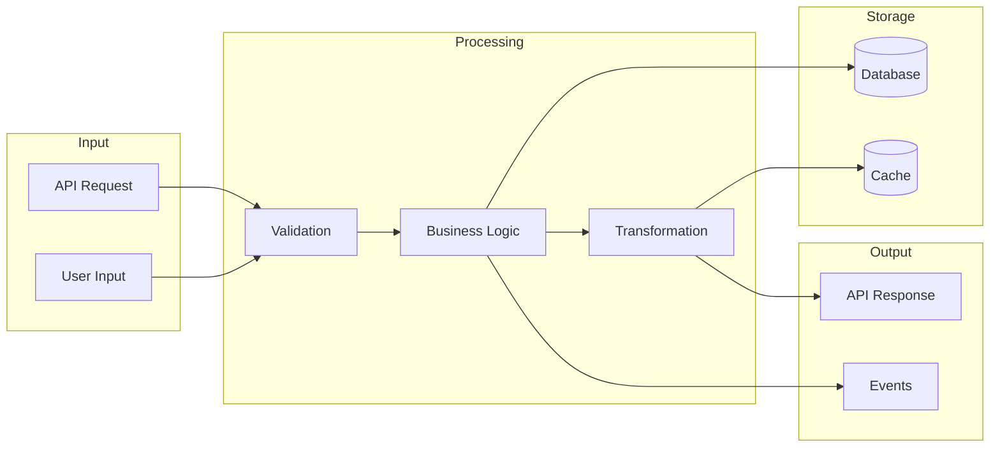

---

## 3. System Design Methodology

### 3.1 Architecture Design Process

```
Phase 1: Requirements Analysis
    |
    v
Phase 2: Quality Attribute Definition
    |
    v
Phase 3: Architectural Strategy
    |
    v
Phase 4: Component Design
    |
    v
Phase 5: Interface Definition
    |
    v
Phase 6: Validation & Review
    |
    v
Phase 7: Documentation
```

### 3.2 Phase 1: Requirements Analysis

#### Functional Requirements Gathering

| Category      | Questions to Ask                              | Artifacts                  |
| ------------- | --------------------------------------------- | -------------------------- |
| Core Features | What are the essential business capabilities? | Feature list, user stories |
| User Journeys | What are the primary user workflows?          | User journey maps          |
| Data Entities | What data does the system manage?             | Entity catalog, ERD        |
| Integrations  | What external systems must we connect to?     | Integration inventory      |
| Constraints   | What technical/business constraints exist?    | Constraint register        |

#### Stakeholder Analysis

```markdown
| Stakeholder   | Concerns                      | Success Criteria             |
| ------------- | ----------------------------- | ---------------------------- |
| End Users     | Usability, performance        | < 2s page load, intuitive UI |
| Operations    | Reliability, maintainability  | 99.9% uptime, easy deploys   |
| Security Team | Compliance, data protection   | SOC2 compliant, encrypted    |
| Business      | Time to market, cost          | 6-month launch, < $X budget  |
| Development   | Developer experience, testing | CI/CD, 80% test coverage     |
```

### 3.3 Phase 2: Quality Attribute Definition

#### Quality Attribute Workshop (QAW) Template

| Attribute       | Stimulus              | Response             | Measure                 |
| --------------- | --------------------- | -------------------- | ----------------------- |
| Performance     | 10K concurrent users  | Serve requests       | P95 < 200ms             |
| Scalability     | 10x traffic spike     | Auto-scale           | Handle within 2 minutes |
| Availability    | Component failure     | Failover to replica  | 99.9% uptime            |
| Security        | SQL injection attempt | Block and log        | Zero successful attacks |
| Maintainability | Bug fix request       | Deploy fix           | < 4 hour mean time      |
| Testability     | New feature           | Automated test suite | 80% coverage            |

#### Quality Attribute Scenarios

```markdown
## Scenario: Performance Under Load

**Source:** External user
**Stimulus:** 10,000 concurrent checkout requests
**Artifact:** Order processing system
**Environment:** Normal operation, peak hours
**Response:** Process all orders without degradation
**Measure:**

- P50 response time < 100ms
- P95 response time < 500ms
- P99 response time < 1s
- Zero dropped requests
```

### 3.4 Phase 3: Architectural Strategy

#### Pattern Selection Matrix

| Requirement                | Pattern Options                      | Recommended    |
| -------------------------- | ------------------------------------ | -------------- |
| Independent team scaling   | Microservices, Modular Monolith      | Microservices  |
| Real-time event processing | Event Sourcing, CQRS, Pub/Sub        | Event Sourcing |
| High read scalability      | CQRS, Read Replicas, Caching         | CQRS + Cache   |
| Distributed transactions   | Saga, 2PC, Outbox Pattern            | Saga Pattern   |
| API composition            | API Gateway, BFF, GraphQL Federation | API Gateway    |
| Cross-cutting concerns     | Service Mesh, Sidecar, Library       | Service Mesh   |

#### Architectural Styles Comparison

| Style                | Best For                               | Trade-offs                          |
| -------------------- | -------------------------------------- | ----------------------------------- |
| **Monolith**         | Small teams, rapid MVP, low complexity | Scaling limits, deployment coupling |
| **Modular Monolith** | Growing teams, clear domains           | Requires discipline, shared DB      |
| **Microservices**    | Large teams, independent scaling       | Complexity, network overhead        |
| **Serverless**       | Event-driven, variable load            | Cold starts, vendor lock-in         |
| **Event-Driven**     | Async workflows, loose coupling        | Eventual consistency, debugging     |
| **Layered**          | Clear separation, traditional apps     | Can become rigid, performance       |
| **Hexagonal**        | Testability, port/adapter isolation    | Initial complexity, abstraction     |

### 3.5 Phase 4: Component Design

#### Component Specification Template

```markdown
## Component: Order Service

### Purpose

Manages order lifecycle from creation to fulfillment.

### Responsibilities

- Order creation and validation
- Order state management
- Order item calculations
- Integration with Payment and Inventory services

### Dependencies

- **Inbound:** API Gateway, Event Bus
- **Outbound:** Payment Service, Inventory Service, Database

### Interfaces

| Interface     | Type     | Protocol | Description                 |
| ------------- | -------- | -------- | --------------------------- |
| /orders       | REST API | HTTPS    | Order CRUD operations       |
| order.created | Event    | AMQP     | Published on order creation |
| order.updated | Event    | AMQP     | Published on state change   |

### Data Ownership

- Order entity (primary owner)
- OrderItem entity (primary owner)
- OrderStatus enum (definition owner)

### Scaling Characteristics

- Stateless (horizontal scaling enabled)
- Target: 10 instances under peak load
- Memory: 512MB-2GB per instance
- CPU: 0.5-2 cores per instance

### SLOs

- Availability: 99.9%
- Latency P95: < 200ms
- Error rate: < 0.1%
```

### 3.6 Phase 5: Interface Definition

#### API Contract Template (OpenAPI)

```yaml
openapi: 3.1.0
info:
  title: Order Service API
  version: 1.0.0
  description: Order management microservice API

paths:
  /orders:
    post:
      summary: Create a new order
      operationId: createOrder
      requestBody:
        required: true
        content:
          application/json:
            schema:
              $ref: "#/components/schemas/CreateOrderRequest"
      responses:
        "201":
          description: Order created
          content:
            application/json:
              schema:
                $ref: "#/components/schemas/Order"
        "400":
          description: Invalid request
        "401":
          description: Unauthorized

components:
  schemas:
    CreateOrderRequest:
      type: object
      required:
        - items
      properties:
        items:
          type: array
          items:
            $ref: "#/components/schemas/OrderItem"

    Order:
      type: object
      properties:
        id:
          type: string
          format: uuid
        status:
          $ref: "#/components/schemas/OrderStatus"
        items:
          type: array
          items:
            $ref: "#/components/schemas/OrderItem"
        total:
          $ref: "#/components/schemas/Money"
        createdAt:
          type: string
          format: date-time
```

#### Event Schema Template (AsyncAPI)

```yaml
asyncapi: 2.6.0
info:
  title: Order Events
  version: 1.0.0

channels:
  orders/created:
    publish:
      message:
        $ref: "#/components/messages/OrderCreated"

  orders/updated:
    publish:
      message:
        $ref: "#/components/messages/OrderUpdated"

components:
  messages:
    OrderCreated:
      payload:
        type: object
        properties:
          orderId:
            type: string
            format: uuid
          userId:
            type: string
            format: uuid
          items:
            type: array
          total:
            type: number
          timestamp:
            type: string
            format: date-time
```

---

## 4. Technology Selection Criteria

### 4.1 Technology Evaluation Framework

#### Evaluation Criteria Matrix

| Criterion             | Weight | Questions                                             |
| --------------------- | ------ | ----------------------------------------------------- |
| **Functional Fit**    | 25%    | Does it solve our problem? Feature completeness?      |
| **Performance**       | 15%    | Latency, throughput, resource efficiency?             |
| **Scalability**       | 15%    | Horizontal/vertical scaling? Proven at scale?         |
| **Security**          | 15%    | Compliance, vulnerability history, security features? |
| **Maintainability**   | 10%    | Code quality, testing, debugging capabilities?        |
| **Community/Support** | 10%    | Active development? Enterprise support available?     |
| **Team Expertise**    | 5%     | Current skills? Learning curve?                       |
| **Cost**              | 5%     | Licensing, infrastructure, operational costs?         |

#### Technology Comparison Template

```markdown
## Technology Comparison: [Category]

### Candidates

1. [Technology A]
2. [Technology B]
3. [Technology C]

### Evaluation Matrix

| Criterion          | Weight | Tech A   | Tech B   | Tech C   |
| ------------------ | ------ | -------- | -------- | -------- |
| Functional Fit     | 25%    | 9/10     | 8/10     | 7/10     |
| Performance        | 15%    | 8/10     | 9/10     | 7/10     |
| Scalability        | 15%    | 9/10     | 8/10     | 6/10     |
| Security           | 15%    | 8/10     | 8/10     | 9/10     |
| Maintainability    | 10%    | 7/10     | 8/10     | 8/10     |
| Community          | 10%    | 9/10     | 7/10     | 6/10     |
| Team Expertise     | 5%     | 8/10     | 6/10     | 5/10     |
| Cost               | 5%     | 7/10     | 8/10     | 9/10     |
| **Weighted Total** | 100%   | **8.35** | **7.90** | **7.15** |

### Recommendation

[Technology A] is recommended because:

1. [Reason 1]
2. [Reason 2]
3. [Reason 3]

### Risks & Mitigations

- [Risk 1]: [Mitigation]
- [Risk 2]: [Mitigation]
```

### 4.2 Common Technology Decisions

#### Database Selection Guide

| Use Case              | Recommended   | Alternatives                 |
| --------------------- | ------------- | ---------------------------- |
| OLTP with ACID        | PostgreSQL    | MySQL, CockroachDB           |
| Document store        | MongoDB       | Couchbase, Amazon DocumentDB |
| Key-value cache       | Redis         | Memcached, KeyDB             |
| Time-series data      | TimescaleDB   | InfluxDB, Prometheus         |
| Full-text search      | Elasticsearch | OpenSearch, Meilisearch      |
| Graph relationships   | Neo4j         | Amazon Neptune, ArangoDB     |
| Wide-column analytics | Cassandra     | ScyllaDB, HBase              |
| Event streaming       | Apache Kafka  | Pulsar, Amazon Kinesis       |

#### Framework Selection Guide

| Use Case              | Recommended           | Alternatives         |
| --------------------- | --------------------- | -------------------- |
| API backend (Node.js) | Fastify, NestJS       | Express, Hono        |
| API backend (Python)  | FastAPI               | Django REST, Flask   |
| API backend (Go)      | Gin, Echo             | Fiber, Chi           |
| API backend (Java)    | Spring Boot           | Quarkus, Micronaut   |
| Web frontend          | Next.js, React        | Vue/Nuxt, Svelte     |
| Mobile cross-platform | React Native, Flutter | Kotlin Multiplatform |
| ML/AI inference       | PyTorch, TensorFlow   | ONNX Runtime, Triton |

### 4.3 Technology Radar

```markdown
## Technology Radar - Q1 2026

### ADOPT (Use in production)

- **Languages:** TypeScript, Python 3.12+, Go 1.22+
- **Frameworks:** Next.js 15, FastAPI, Gin
- **Databases:** PostgreSQL 16, Redis 7
- **Infrastructure:** Kubernetes, Terraform

### TRIAL (Evaluate in projects)

- **Languages:** Rust (for performance-critical)
- **Frameworks:** Bun, Deno 2.0
- **Databases:** CockroachDB, Neon
- **AI/ML:** LangChain, LlamaIndex

### ASSESS (Research and prototype)

- **Languages:** Zig, Mojo
- **Frameworks:** HTMX, Solid.js
- **Databases:** Turso (libSQL)
- **Infrastructure:** WebAssembly runtime

### HOLD (Avoid for new projects)

- **Languages:** Python 2.x, Node.js < 18
- **Frameworks:** AngularJS, jQuery
- **Databases:** MongoDB < 5.0
- **Infrastructure:** Docker Swarm
```

---

## 5. Scalability Patterns

### 5.1 Horizontal Scaling Patterns

#### Stateless Service Pattern

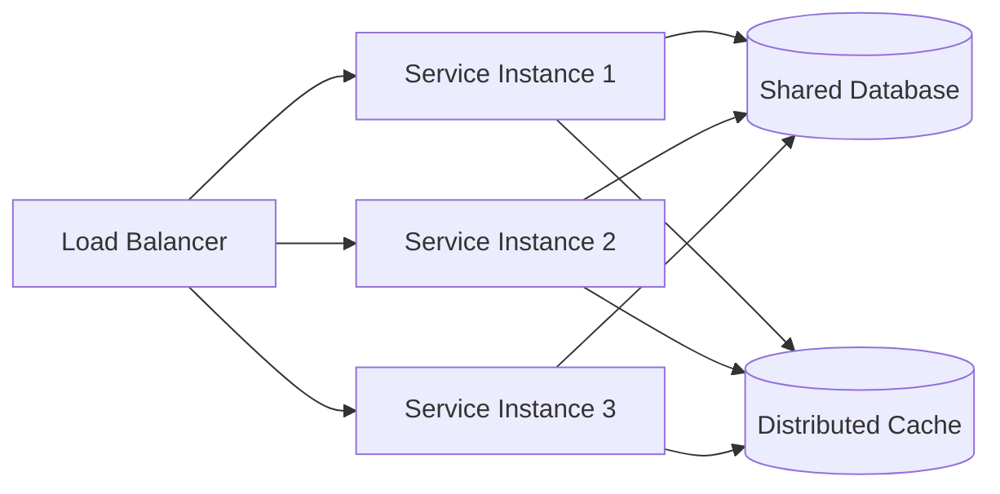

**Implementation Guidelines:**

- Store session state in distributed cache (Redis)
- Use JWT for stateless authentication
- Externalize configuration
- Use connection pooling for database access

#### Database Scaling Patterns

| Pattern            | Use Case                      | Implementation                  |
| ------------------ | ----------------------------- | ------------------------------- |
| **Read Replicas**  | Read-heavy workloads          | Primary + N read replicas       |
| **Sharding**       | Write-heavy, large datasets   | Consistent hashing, range-based |
| **CQRS**           | Different read/write patterns | Separate read/write models      |
| **Event Sourcing** | Audit, temporal queries       | Append-only event log           |
| **Caching**        | Reduce database load          | Redis/Memcached with TTL        |

#### Sharding Strategies

```mermaid
graph TB
    subgraph "Hash-Based Sharding"
        Router1[Router] --> |hash(user_id) % N| Shard1[(Shard 1)]
        Router1 --> Shard2[(Shard 2)]
        Router1 --> Shard3[(Shard 3)]
    end

    subgraph "Range-Based Sharding"
        Router2[Router] --> |A-H| Shard4[(Shard A-H)]
        Router2 --> |I-P| Shard5[(Shard I-P)]
        Router2 --> |Q-Z| Shard6[(Shard Q-Z)]
    end

    subgraph "Geographic Sharding"
        Router3[Router] --> |US| Shard7[(US Region)]
        Router3 --> |EU| Shard8[(EU Region)]
        Router3 --> |APAC| Shard9[(APAC Region)]
    end
```

### 5.2 Vertical Scaling Considerations

| Resource | Scaling Indicators           | Optimization Before Scaling             |
| -------- | ---------------------------- | --------------------------------------- |
| CPU      | Sustained >80% utilization   | Profile hotspots, optimize algorithms   |
| Memory   | OOM errors, high swap usage  | Memory profiling, reduce caching        |
| Disk I/O | High wait times, queue depth | SSD upgrade, optimize queries           |
| Network  | Bandwidth saturation         | Compression, CDN, protocol optimization |

### 5.3 Auto-Scaling Configuration

```yaml
# Kubernetes HPA Example
apiVersion: autoscaling/v2
kind: HorizontalPodAutoscaler
metadata:
  name: order-service-hpa
spec:
  scaleTargetRef:
    apiVersion: apps/v1
    kind: Deployment
    name: order-service
  minReplicas: 3
  maxReplicas: 50
  metrics:
    - type: Resource
      resource:
        name: cpu
        target:
          type: Utilization
          averageUtilization: 70
    - type: Resource
      resource:
        name: memory
        target:
          type: Utilization
          averageUtilization: 80
    - type: Pods
      pods:
        metric:
          name: requests_per_second
        target:
          type: AverageValue
          averageValue: 1000
  behavior:
    scaleUp:
      stabilizationWindowSeconds: 60
      policies:
        - type: Percent
          value: 100
          periodSeconds: 60
    scaleDown:
      stabilizationWindowSeconds: 300
      policies:
        - type: Percent
          value: 10
          periodSeconds: 60
```

### 5.4 Caching Strategy

#### Cache-Aside Pattern

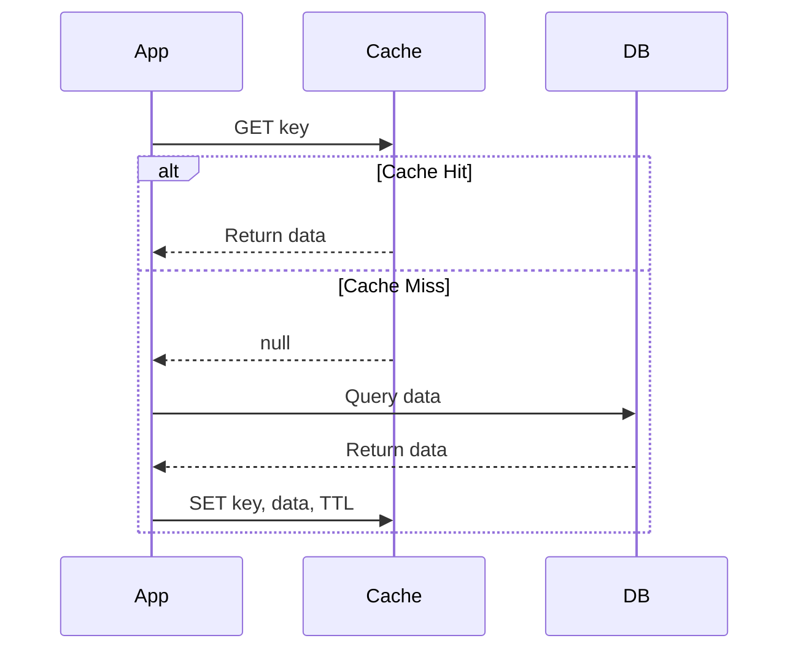

#### Cache Invalidation Strategies

| Strategy          | Description                 | Use Case                  |
| ----------------- | --------------------------- | ------------------------- |
| **TTL-based**     | Expire after fixed time     | Static content, config    |
| **Write-through** | Update cache on write       | Strong consistency needed |
| **Write-behind**  | Async update after write    | High write throughput     |
| **Event-driven**  | Invalidate on domain events | Eventually consistent     |
| **Cache tags**    | Group-based invalidation    | Related data sets         |

---

## 6. Security Architecture

### 6.1 Security by Design Principles

| Principle                  | Implementation                                |
| -------------------------- | --------------------------------------------- |
| **Defense in Depth**       | Multiple security layers (network, app, data) |
| **Least Privilege**        | Minimal permissions per component             |
| **Zero Trust**             | Verify every request, assume breach           |
| **Secure by Default**      | Secure configurations out of the box          |
| **Fail Securely**          | Deny access on failure, don't expose details  |
| **Separation of Concerns** | Isolate security controls from business logic |

### 6.2 Authentication Architecture

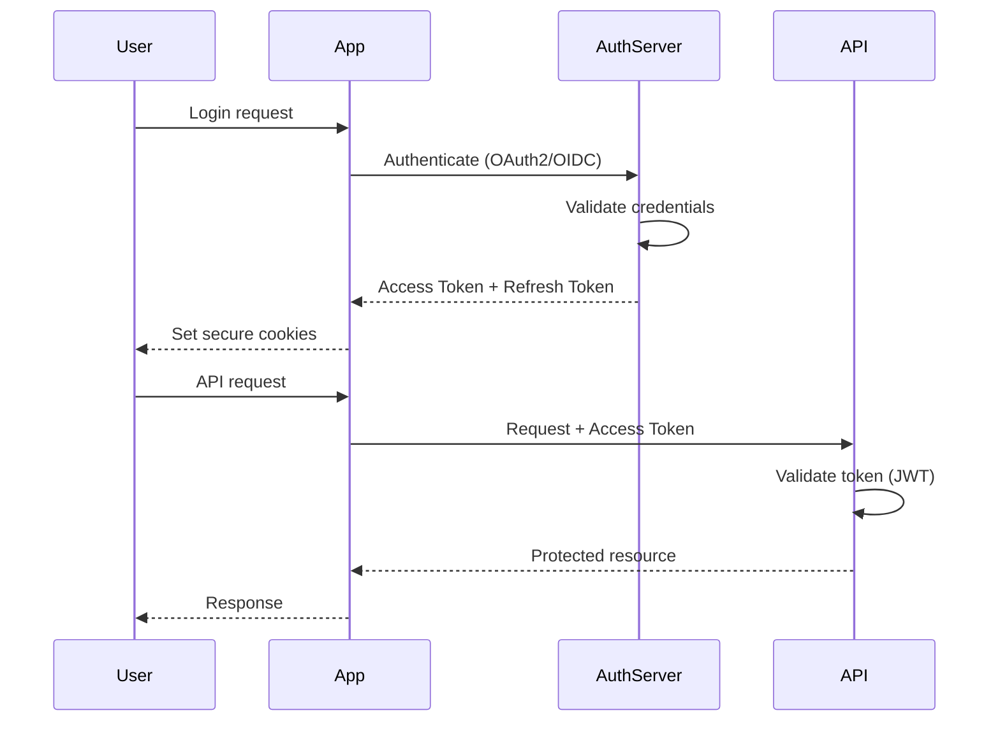

#### Token Strategy

| Token Type    | Lifetime | Storage                | Use Case             |
| ------------- | -------- | ---------------------- | -------------------- |
| Access Token  | 15 min   | Memory (client)        | API authorization    |
| Refresh Token | 7 days   | HttpOnly secure cookie | Token renewal        |
| ID Token      | 15 min   | Memory (client)        | User identity claims |
| API Key       | Long     | Secure vault           | Service-to-service   |

### 6.3 Authorization Patterns

#### Role-Based Access Control (RBAC)

```yaml
roles:
  admin:
    permissions:
      - users:read
      - users:write
      - orders:read
      - orders:write
      - reports:read

  manager:
    permissions:
      - users:read
      - orders:read
      - orders:write
      - reports:read

  user:
    permissions:
      - orders:read:own
      - orders:write:own
```

#### Attribute-Based Access Control (ABAC)

```json
{
  "policy": "order_access",
  "effect": "allow",
  "conditions": {
    "all": [
      { "attribute": "user.department", "equals": "resource.department" },
      {
        "attribute": "user.level",
        "greaterThanOrEquals": "resource.sensitivity"
      },
      { "attribute": "context.time", "between": ["09:00", "17:00"] }
    ]
  }
}
```

### 6.4 Data Protection

#### Encryption Strategy

| Data State | Method                       | Key Management            |
| ---------- | ---------------------------- | ------------------------- |
| At Rest    | AES-256-GCM                  | AWS KMS / HashiCorp Vault |
| In Transit | TLS 1.3                      | Certificate Manager       |
| In Use     | Application-level encryption | Envelope encryption       |

#### Data Classification

| Level            | Examples                     | Controls                             |
| ---------------- | ---------------------------- | ------------------------------------ |
| **Public**       | Marketing content            | No restrictions                      |
| **Internal**     | Internal docs, non-sensitive | Access control, no public exposure   |
| **Confidential** | Customer data, business data | Encryption, access logs, retention   |
| **Restricted**   | PII, financial, health data  | Strong encryption, audit, compliance |

### 6.5 Network Security Architecture

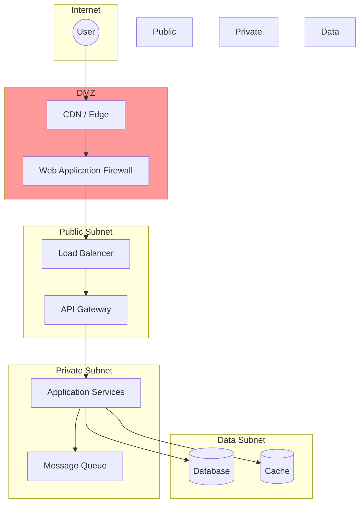

---

## 7. Integration Patterns

### 7.1 Synchronous Integration Patterns

#### API Gateway Pattern

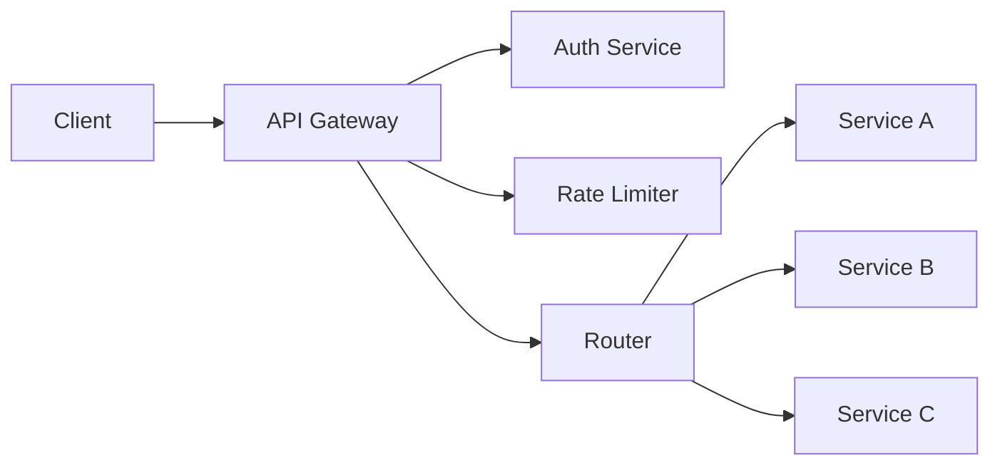

**API Gateway Responsibilities:**

- Request routing
- Authentication/Authorization
- Rate limiting
- Request/Response transformation
- Caching
- Logging and monitoring

#### Backend for Frontend (BFF)

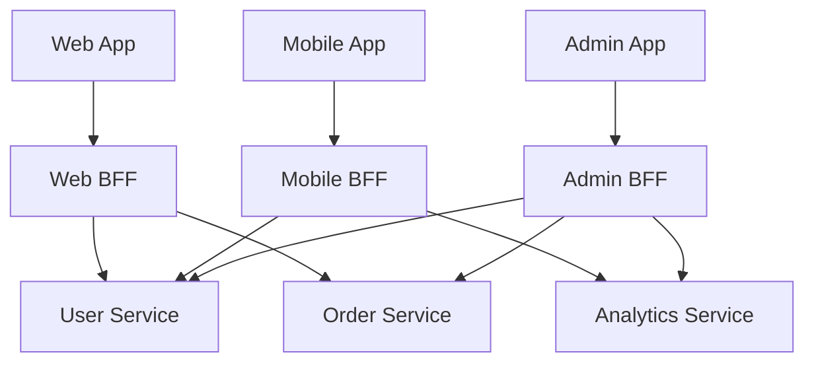

### 7.2 Asynchronous Integration Patterns

#### Event-Driven Architecture

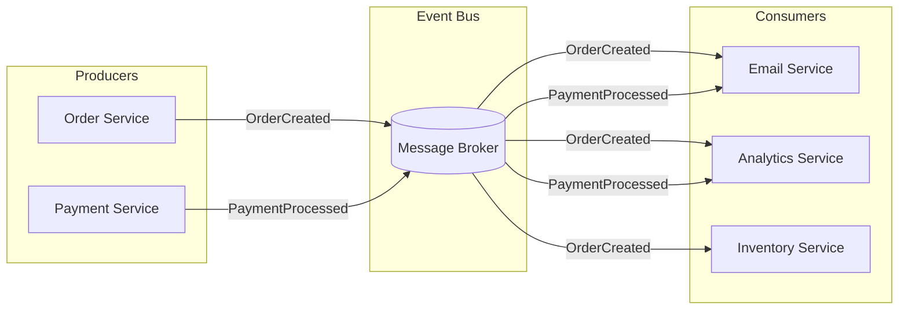

#### Saga Pattern (Choreography)

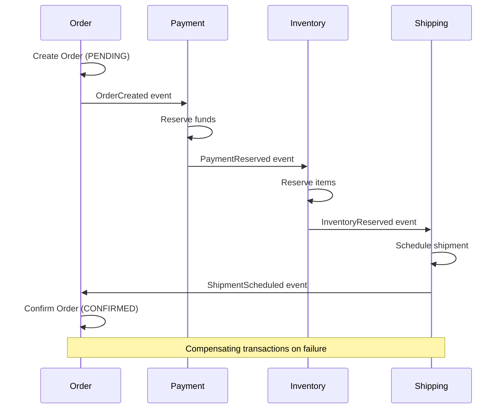

#### Saga Pattern (Orchestration)

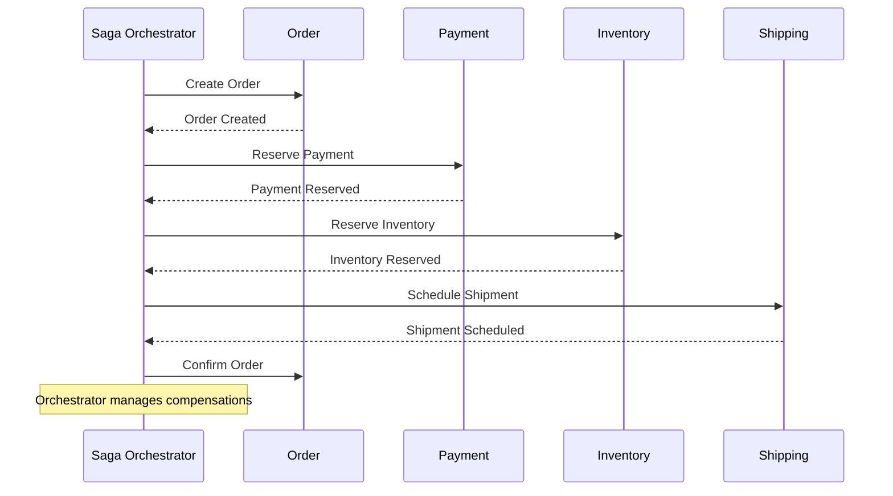

### 7.3 Integration Anti-Patterns to Avoid

| Anti-Pattern         | Problem                           | Solution                         |
| -------------------- | --------------------------------- | -------------------------------- |
| Shared Database      | Tight coupling, no encapsulation  | API-based integration            |
| Synchronous Chaining | Cascading failures, latency       | Async messaging, circuit breaker |
| Distributed Monolith | Microservices with tight coupling | Proper bounded contexts          |
| Big Bang Integration | Late integration, high risk       | Continuous integration           |
| Point-to-Point       | N^2 connections, maintenance      | Message broker, event bus        |

---

## 8. Performance Considerations

### 8.1 Performance Requirements Template

```markdown
## Performance Requirements

### Response Time

| Operation          | P50 Target | P95 Target | P99 Target |
| ------------------ | ---------- | ---------- | ---------- |
| API read (simple)  | 50ms       | 100ms      | 200ms      |
| API read (complex) | 100ms      | 300ms      | 500ms      |
| API write          | 100ms      | 200ms      | 500ms      |
| Page load (FCP)    | 1s         | 2s         | 3s         |
| Page interactive   | 2s         | 3s         | 5s         |

### Throughput

| Operation        | Normal Load | Peak Load | Burst  |
| ---------------- | ----------- | --------- | ------ |
| API requests     | 1K/s        | 5K/s      | 10K/s  |
| Event processing | 10K/s       | 50K/s     | 100K/s |
| Database writes  | 100/s       | 500/s     | 1K/s   |

### Resource Utilization

| Resource | Target | Alert | Critical |
| -------- | ------ | ----- | -------- |
| CPU      | < 60%  | > 80% | > 95%    |
| Memory   | < 70%  | > 85% | > 95%    |
| Disk I/O | < 50%  | > 75% | > 90%    |
| Network  | < 50%  | > 75% | > 90%    |
```

### 8.2 Performance Optimization Strategies

#### Application Layer

| Strategy             | Implementation                   | Impact         |
| -------------------- | -------------------------------- | -------------- |
| Connection pooling   | Reuse DB/HTTP connections        | -50% latency   |
| Response compression | gzip/brotli for payloads > 1KB   | -70% bandwidth |
| Lazy loading         | Load on demand, not upfront      | -40% initial   |
| Async processing     | Background jobs for non-critical | -60% response  |
| Batch operations     | Combine multiple operations      | -80% overhead  |

#### Database Layer

| Strategy            | Implementation                    | Impact       |
| ------------------- | --------------------------------- | ------------ |
| Query optimization  | EXPLAIN ANALYZE, index tuning     | -90% query   |
| Read replicas       | Route reads to replicas           | +300% read   |
| Connection pooling  | PgBouncer, ProxySQL               | -50% connect |
| Prepared statements | Reuse query plans                 | -30% parse   |
| Partitioning        | Range/hash partition large tables | -80% scan    |

#### Caching Layer

| Cache Type        | Use Case               | TTL            |
| ----------------- | ---------------------- | -------------- |
| Browser cache     | Static assets          | 1 year         |
| CDN cache         | Static + API responses | 5 min - 1 day  |
| Application cache | Computed results       | 1 min - 1 hr   |
| Database cache    | Query results          | 10 sec - 5 min |
| Session cache     | User sessions          | 30 min         |

### 8.3 Performance Monitoring

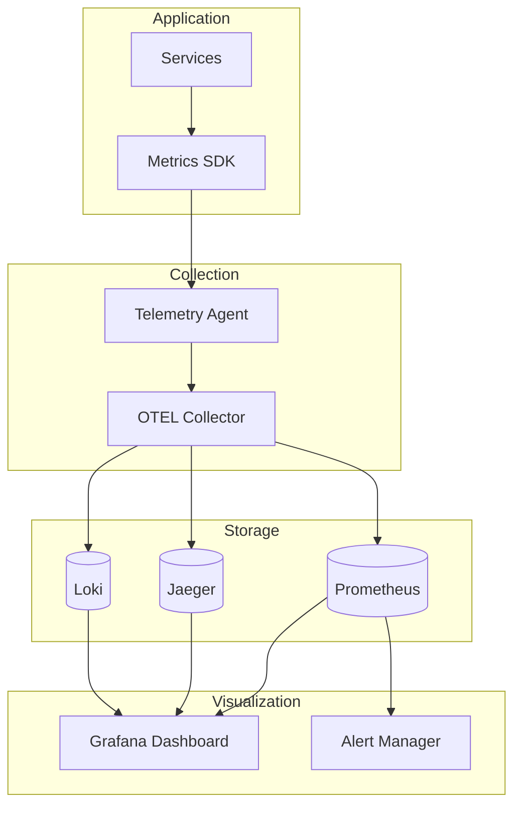

---

## 9. Cost Optimization

### 9.1 Cloud Cost Optimization Strategies

#### Compute Optimization

| Strategy               | Savings Potential | Implementation                      |
| ---------------------- | ----------------- | ----------------------------------- |
| Right-sizing           | 20-40%            | Match instance to actual usage      |
| Reserved instances     | 30-60%            | 1-3 year commitments                |
| Spot/Preemptible       | 60-90%            | Fault-tolerant, stateless workloads |
| Auto-scaling           | 20-50%            | Scale down during low traffic       |
| Container optimization | 30-50%            | Multi-tenant, bin packing           |

#### Database Optimization

| Strategy           | Savings Potential | Implementation                     |
| ------------------ | ----------------- | ---------------------------------- |
| Reserved capacity  | 30-50%            | Predictable workload commitment    |
| Serverless         | 40-70%            | Variable, unpredictable workloads  |
| Read replicas      | 20-30%            | Smaller primary, distributed reads |
| Storage tiering    | 50-70%            | Move cold data to cheaper storage  |
| Connection pooling | 10-20%            | Reduce connection overhead         |

### 9.2 Architecture Cost Analysis

```markdown
## Cost Comparison: Monolith vs Microservices

### Scenario: 100K daily users, 1M API calls/day

### Monolith Architecture

| Component         | Monthly Cost |
| ----------------- | ------------ |
| 4x c5.2xlarge     | $1,100       |
| RDS db.r5.2xlarge | $800         |
| ALB               | $50          |
| Data transfer     | $100         |
| **Total**         | **$2,050**   |

### Microservices Architecture

| Component        | Monthly Cost |
| ---------------- | ------------ |
| 12x c5.xlarge    | $1,250       |
| RDS db.r5.xlarge | $400         |
| ElastiCache      | $150         |
| API Gateway      | $100         |
| Lambda (glue)    | $50          |
| Message Queue    | $100         |
| ALB              | $75          |
| Data transfer    | $150         |
| **Total**        | **$2,275**   |

### Analysis

- Microservices: +11% cost, +200% scalability headroom
- Break-even at 200K daily users
- Microservices preferred if growth > 50%/year expected
```

### 9.3 FinOps Best Practices

| Practice                    | Implementation                          |
| --------------------------- | --------------------------------------- |
| **Tagging strategy**        | Environment, team, cost-center tags     |
| **Budget alerts**           | 50%, 80%, 100% threshold notifications  |
| **Unused resource cleanup** | Weekly scan for orphaned resources      |
| **Reserved planning**       | Quarterly review of commitment coverage |
| **Spot/Preemptible mix**    | 30-50% for stateless workloads          |
| **Multi-region efficiency** | Consolidate where possible              |

---

## 10. Migration and Modernization Strategies

### 10.1 Migration Approaches

#### The 6 Rs of Migration

| Strategy       | Description            | Use When                           |
| -------------- | ---------------------- | ---------------------------------- |
| **Rehost**     | Lift and shift         | Quick migration, minimal changes   |
| **Replatform** | Lift and optimize      | Minor optimizations needed         |
| **Repurchase** | Replace with SaaS      | Commodity functionality            |
| **Refactor**   | Re-architect for cloud | Scalability, cloud-native benefits |
| **Retain**     | Keep as-is             | Recent investment, compliance      |
| **Retire**     | Decommission           | Unused, redundant systems          |

### 10.2 Strangler Fig Pattern

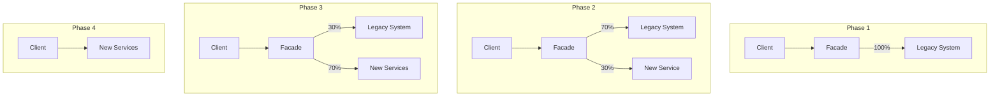

### 10.3 Migration Roadmap Template

```markdown
## Migration Roadmap: [System Name]

### Phase 0: Foundation (Weeks 1-4)

- [ ] Complete system inventory
- [ ] Establish monitoring baseline
- [ ] Set up target environment
- [ ] Create rollback procedures
- [ ] Define success metrics

### Phase 1: Pilot (Weeks 5-8)

- [ ] Migrate non-critical component
- [ ] Validate data integrity
- [ ] Performance baseline comparison
- [ ] Team training
- [ ] Refine procedures

### Phase 2: Core Migration (Weeks 9-16)

- [ ] Migrate core services incrementally
- [ ] Daily data sync verification
- [ ] Parallel running period
- [ ] Cutover rehearsals
- [ ] Stakeholder communication

### Phase 3: Optimization (Weeks 17-20)

- [ ] Decommission legacy components
- [ ] Performance tuning
- [ ] Cost optimization
- [ ] Documentation update
- [ ] Lessons learned

### Rollback Triggers

- Data inconsistency > 0.01%
- Error rate > 5% baseline
- Latency > 2x baseline
- Critical functionality failure

### Success Criteria

- Zero data loss
- < 4 hour total downtime
- Performance within 10% of baseline
- All integrations verified
```

### 10.4 Monolith to Microservices

#### Domain-Driven Decomposition

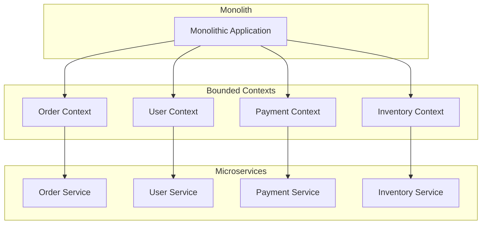

#### Decomposition Strategy

| Step | Action                           | Deliverables                   |
| ---- | -------------------------------- | ------------------------------ |
| 1    | Identify bounded contexts        | Context map, domain model      |
| 2    | Analyze dependencies             | Dependency graph, data flow    |
| 3    | Define service boundaries        | Service catalog, ownership     |
| 4    | Design data ownership            | Data partitioning strategy     |
| 5    | Plan extraction order            | Prioritized extraction backlog |
| 6    | Implement integration layer      | API facade, event bus          |
| 7    | Extract services incrementally   | Working microservices          |
| 8    | Decommission monolith components | Reduced monolith scope         |

---

## 11. Integration with Tri-Agent Workflow

### Role in Tri-Agent System

```
+--------------------+
|  Architect Agent   |  <- Architecture, decisions, patterns
+--------------------+
         |
    Orchestrates
         |
+--------+---------+
|                  |
v                  v
+----------+  +------------+
| Codex    |  | Gemini     |
| GPT-5.2  |  | 3 Pro      |
+----------+  +------------+
Implementation   Validation
```

### Phase Assignments

| Phase              | Architect Role                             | Handoff To                  |
| ------------------ | ------------------------------------------ | --------------------------- |
| **Planning**       | Define architecture, create C4, write ADRs | Gemini (context validation) |
| **Implementation** | Review critical designs, approve patterns  | Codex (implementation)      |
| **Verification**   | Architecture compliance review             | Gemini (documentation)      |

### Tri-Agent Invocation Pattern

```bash
# Phase 1: Architect designs system (Claude with ultrathink)
# Direct in Claude Code session with /model opus

# Phase 2: Gemini validates architecture
gemini -m gemini-3-pro-preview --approval-mode yolo \
  "Validate this architecture against requirements:
  [ARCHITECT_OUTPUT]

  Check:
  1. All requirements addressed
  2. No conflicting patterns
  3. Scalability concerns
  4. Security gaps

  Output: PASS/FAIL with findings"

# Phase 3: Codex implements
codex exec -m gpt-5.2-codex -c 'model_reasoning_effort="xhigh"' -s workspace-write \
  "Implement skeleton based on architecture:
  [ARCHITECT_OUTPUT]

  Generate:
  1. Project structure
  2. Interface definitions
  3. Core abstractions
  4. Test scaffolding"
```

### Verification Protocol

```markdown
VERIFY:

- Scope: Architecture design for [system/component]
- Change summary: [Architecture decisions made]
- Expected behavior: [Concrete outcomes from implementation]
- Repro steps: [How to validate architecture compliance]
- Evidence to check: [ADRs, diagrams, interface contracts]
- Risk notes: [Scalability limits, security considerations]

Verifier: Gemini (3 Pro) or Codex (GPT-5.2)
```

---

## 12. Quick Reference

### Command

```
/agents/planning/architect [architecture task]
```

### Examples

```bash
# System design
/agents/planning/architect design microservices architecture for e-commerce platform

# Technology selection
/agents/planning/architect evaluate database options for high-write IoT platform

# Migration planning
/agents/planning/architect create migration plan from monolith to microservices

# Architecture review
/agents/planning/architect review current architecture for scalability issues

# Security architecture
/agents/planning/architect design zero-trust security architecture

# Performance optimization
/agents/planning/architect identify bottlenecks and propose optimization strategy
```

### Configuration Summary

| Setting         | Value                    |
| --------------- | ------------------------ |
| Category        | Planning                 |
| Level           | 3 (Full capability)      |
| Recommended     | Claude Opus + ultrathink |
| Thinking Budget | 32K tokens               |
| Context Window  | 200K tokens              |
| Daily Cap       | $15                      |

### Deliverable Checklist

For every architecture task, ensure:

- [ ] C4 diagrams (at minimum Context and Container levels)
- [ ] Architecture Decision Record (ADR) for each major decision
- [ ] Component specifications with interfaces
- [ ] Quality attribute requirements documented
- [ ] Security considerations addressed
- [ ] Scalability strategy defined
- [ ] Cost analysis included
- [ ] Migration/implementation roadmap
- [ ] Risk register with mitigations
- [ ] Verification by second AI completed

---

## 13. Related Agents

- `/agents/ai-ml/claude-opus-max` - Deep reasoning for complex decisions
- `/agents/backend/microservices-architect` - Microservices-specific patterns
- `/agents/backend/api-architect` - API design and contracts
- `/agents/database/database-architect` - Database schema and optimization
- `/agents/security/security-expert` - Security architecture review
- `/agents/devops/kubernetes-expert` - Container orchestration patterns
- `/agents/cloud/aws-expert` - AWS architecture patterns
- `/agents/cloud/gcp-expert` - GCP architecture patterns
- `/agents/planning/tech-lead` - Technical leadership decisions
- `/agents/business/cost-optimizer` - Cloud cost optimization

---

## 14. Appendix: Architecture Checklists

### New System Checklist

- [ ] Requirements documented (functional + non-functional)
- [ ] Stakeholders identified and concerns captured
- [ ] Quality attributes defined with measurable targets
- [ ] Technology evaluation completed
- [ ] C4 diagrams created (all 4 levels)
- [ ] ADRs written for all major decisions
- [ ] API contracts defined
- [ ] Data model documented
- [ ] Security architecture reviewed
- [ ] Scalability strategy documented
- [ ] Disaster recovery plan
- [ ] Cost estimate approved
- [ ] Implementation roadmap created
- [ ] Team capacity validated

### Architecture Review Checklist

- [ ] System context diagram current
- [ ] All ADRs up to date
- [ ] Dependencies documented
- [ ] Technical debt inventory
- [ ] Security posture assessment
- [ ] Performance baselines established
- [ ] Scalability headroom analyzed
- [ ] Cost efficiency reviewed
- [ ] Compliance requirements met
- [ ] Disaster recovery tested

### Migration Readiness Checklist

- [ ] Source system fully documented
- [ ] Target architecture designed
- [ ] Data migration strategy defined
- [ ] Integration points mapped
- [ ] Rollback procedures tested
- [ ] Parallel running plan
- [ ] Cutover schedule approved
- [ ] Communication plan ready
- [ ] Team training completed
- [ ] Success metrics defined
