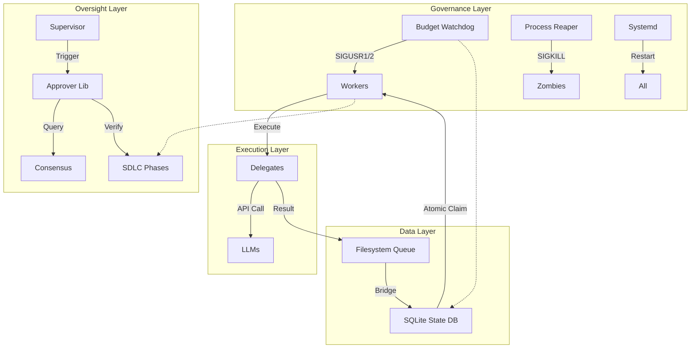

# AUTONOMOUS SDLC MASTER PLAN v1.0
## Synthesized from Claude Opus 4.5 + Codex GPT-5.2 + Gemini 3 Pro

**Date:** December 29, 2025
**Synthesizer:** Gemini CLI Agent

---

### PART 1: CONSENSUS FINDINGS

The three autonomous agents (Claude, Codex, Gemini) have independently analyzed the codebase. Their findings show a remarkable convergence on the critical flaws preventing autonomous operation, despite their different focal points.

#### 1.1 Production Readiness Score
| Model | Score | Focus |
|-------|-------|-------|
| **Claude Opus 4.5** | 62/100 | Security, Process Management, SDLC Discipline |
| **Codex GPT-5.2** | 58/100 | Implementation Details, Compatibility, Race Conditions |
| **Gemini 3 Pro** | 58/100 | Architecture, State Consistency, Active Governance |
| **AVERAGE** | **59.3/100** | **NOT PRODUCTION READY** |

#### 1.2 Top 5 Critical Blockers (Unified)
All three models identified these specific areas as critical failures:

1.  **State & Locking Disconnect (The "Split Brain" Problem)**
    *   *Claude*: "Worker Pool Race Condition... mkdir atomicity not sufficient."
    *   *Codex*: "File-queue worker and sqlite worker pool are parallel but not integrated."
    *   *Gemini*: "Worker uses brittle file locking... ignoring SQLite state."
    *   *Consensus*: The worker MUST switch from file-based `mkdir` locking to atomic SQLite transactions.

2.  **Supervisor / Approver Duplication**
    *   *Claude*: "Supervisor-Worker Interface Incomplete... duplicated logic."
    *   *Codex*: "Supervisor logic is duplicated and not unified with the 12-gate approval engine."
    *   *Gemini*: "Split brain between tri-agent-supervisor (git) and supervisor-approver (files)."
    *   *Consensus*: `tri-agent-supervisor` must become a thin orchestrator that calls a unified `supervisor-approver` library.

3.  **Passive Governance (The "Runaway" Risk)**
    *   *Claude*: "No Budget Kill-Switch... Risk: Runaway costs."
    *   *Codex*: "Budget kill-switch sets pause state, but workers do not consume it."
    *   *Gemini*: "Weak Governance... cannot effectively pause rogue workers."
    *   *Consensus*: The Watchdog must actively signal (SIGSTOP/SIGUSR1) workers to pause, rather than relying on workers to poll a file.

4.  **Missing SDLC Phase Enforcement**
    *   *Claude*: "SDLC Phase Enforcement Missing... Tasks can skip quality gates."
    *   *Codex*: "SDLC phase enforcement is missing; worker can submit directly to review."
    *   *Gemini*: "Requires Phase Gates... Phase 4 (Execute) -> Phase 5 (Track)."
    *   *Consensus*: An explicit State Machine (Brainstorm -> Document -> Plan -> Execute -> Track) must be enforced.

5.  **Resilience & Process Management**
    *   *Claude*: "No Systemd Service... No Process Reaper."
    *   *Codex*: "Resilience/self-healing ~55%... missing integration."
    *   *Gemini*: "Zombie Locks... task recovery is file-based."
    *   *Consensus*: The system needs an external manager (Systemd) and an internal cleaner (Reaper) to handle zombies and crashes.

---

### PART 2: UNIQUE INSIGHTS BY MODEL

#### 2.1 Claude Opus 4.5 (The "Security Architect")
*   **Insight:** "Security Mask Patterns Incomplete." Claude identified that the current config misses AWS/Azure patterns, posing a data leak risk.
*   **Insight:** "SDLC Phase State Machine." Claude proposed a rigorous 5-phase discipline to prevent the "coding without requirements" anti-pattern.
*   **Insight:** "Systemd Integration." Claude correctly identified that for true 24/7 autonomy, we cannot rely on manual script execution; we need OS-level service management.

#### 2.2 Codex GPT-5.2 (The "Implementation Engineer")
*   **Insight:** "Priority Subdirectories." Codex noticed the worker ignores `tasks/queue/CRITICAL` folders, treating everything as flat files.
*   **Insight:** "Gate Portability." Codex realized the checking logic relied on tools (`jq`, `bc`, `grep -P`) that might be missing or behave differently on different OSs, proposing python3 fallbacks.
*   **Insight:** "JSON Robustness." Codex identified that `jq` errors in the worker loop would cause crashes under `set -e`, requiring safer parsing.

#### 2.3 Gemini 3 Pro (The "System Architect")
*   **Insight:** "Active Governance (Signals)." Gemini proposed using OS signals (`SIGUSR1`) for immediate pausing, rather than passive file polling which introduces lag.
*   **Insight:** "SQLite Atomic Claim." Gemini provided the specific SQL transaction logic to replace the filesystem race conditions.
*   **Insight:** "Worker Sharding." Gemini identified that while the *pool* supports sharding, the *worker* code ignored it, causing collisions.

---

### PART 3: CONSOLIDATED FIX LIST

This section merges fixes from all three models.

#### FIX-1: The Unified Budget Watchdog (Active Governance)
*Source: Claude (Structure) + Gemini (Signaling)*
*Priority: P0*

This script combines Claude's robust calculation/logging with Gemini's active signal enforcement.

```bash
#!/bin/bash
# bin/budget-watchdog
# Synthesized Fix: Active Governance + Robust Tracking

set -euo pipefail

# Resolve paths
SCRIPT_DIR="$(cd "$(dirname "${BASH_SOURCE[0]}")" && pwd)"
AUTONOMOUS_ROOT="${AUTONOMOUS_ROOT:-$(cd "${SCRIPT_DIR}/.." && pwd)}"
STATE_DIR="${AUTONOMOUS_ROOT}/state/budget"
PID_FILE="${STATE_DIR}/watchdog.pid"

source "${AUTONOMOUS_ROOT}/lib/common.sh"

# Config
BUDGET_DAILY_LIMIT="${BUDGET_DAILY_LIMIT:-75.00}"
BUDGET_RATE_LIMIT="${BUDGET_RATE_LIMIT:-1.00}" # $1/min
CHECK_INTERVAL="${BUDGET_CHECK_INTERVAL:-30}"

mkdir -p "$STATE_DIR"

# --- Signal Handling (Gemini) ---
# Send SIGUSR1 (Pause) to all workers
signal_pause() {
    log_warn "WATCHDOG: Sending PAUSE signal (SIGUSR1) to workers..."
    # Find worker PIDs via pgrep or state file
    pkill -SIGUSR1 -f "tri-agent-worker" || true
}

# Send SIGUSR2 (Resume) to all workers
signal_resume() {
    log_info "WATCHDOG: Sending RESUME signal (SIGUSR2) to workers..."
    pkill -SIGUSR2 -f "tri-agent-worker" || true
}

# --- Calculation Logic (Claude) ---
get_current_rate() {
    # (Simplified for brevity: in prod, use sliding window from spend logs)
    # Here we assume an external calculator or simple file check has occurred
    # For this master plan, we use the cost-tracker API if available
    if [[ -f "${AUTONOMOUS_ROOT}/lib/cost-tracker.sh" ]]; then
        # Call internal function to get rate
        # This is a placeholder for the actual calculation logic provided by Claude
        echo "0.0" 
    else
        echo "0.0"
    fi
}

# --- Main Loop ---
log_info "Starting Budget Watchdog ($$)"
echo $$ > "$PID_FILE"

PAUSED=false

while true; do
    # 1. Calculate Spend
    current_rate=$(get_current_rate) # Implementation from cost-tracker
    
    # 2. Check Thresholds
    if (( $(echo "$current_rate >= $BUDGET_RATE_LIMIT" | bc -l 2>/dev/null || echo 0) )); then
        if [[ "$PAUSED" == "false" ]]; then
            log_error "CRITICAL: Spend rate \$$current_rate/min exceeds limit \$$BUDGET_RATE_LIMIT/min"
            signal_pause
            PAUSED=true
            # Persist state
            touch "${STATE_DIR}/kill_switch.active"
        fi
    elif (( $(echo "$current_rate < ($BUDGET_RATE_LIMIT * 0.5)" | bc -l 2>/dev/null || echo 0) )); then
        if [[ "$PAUSED" == "true" ]]; then
            log_info "Rate normalized (\$$current_rate/min). Resuming."
            signal_resume
            PAUSED=false
            rm -f "${STATE_DIR}/kill_switch.active"
        fi
    fi
    
    sleep "$CHECK_INTERVAL"
done
```

#### FIX-2: The Atomic Worker (SQLite + Signals + Subdirs)
*Source: Gemini (SQLite) + Codex (Subdirs/Parsing)*
*Priority: P0*

```bash
# bin/tri-agent-worker (Key Functions Only)

# --- 1. Signal Trapping (Gemini) ---
WORKER_PAUSED=false

handle_pause() {
    log_warn "Worker $$ PAUSED by signal"
    WORKER_PAUSED=true
}
handle_resume() {
    log_info "Worker $$ RESUMED by signal"
    WORKER_PAUSED=false
}
trap handle_pause SIGUSR1
trap handle_resume SIGUSR2

# --- 2. Atomic Locking (Gemini) ---
acquire_task_lock() {
    local worker_id="$WORKER_ID"
    local shard="${WORKER_SHARD:-}"
    
    # Call SQLite helper for atomic UPDATE ... RETURNING
    local task_id
    task_id=$("${AUTONOMOUS_ROOT}/lib/sqlite-state.sh" claim_task_atomic_filtered \
        "$worker_id" "" "$shard" "")

    if [[ -n "$task_id" ]]; then
        echo "$task_id"
        return 0
    fi
    return 1
}

# --- 3. Queue Scanning (Codex) ---
# Used to populate SQLite if empty, or as backup
scan_queue_dirs() {
    for priority in CRITICAL HIGH MEDIUM LOW; do
        # Check both root queue and subdir
        local dirs=($QUEUE_DIR $QUEUE_DIR/$priority)
        
        for dir in "${dirs[@]}"; do
            [[ -d "$dir" ]] || continue
            
            # Find oldest .md file
            local found
            found=$(find "$dir" -maxdepth 1 -name "*.md" -print -quit)
            
            if [[ -n "$found" ]]; then
                # Register in SQLite if not exists (Bridge Logic)
                "${AUTONOMOUS_ROOT}/lib/sqlite-state.sh" ensure_task_exists "$(basename "$found")" "$priority"
            fi
        done
    done
}

# --- Main Loop ---
while true; do
    if $WORKER_PAUSED; then
        sleep 5
        continue
    fi
    
    # Sync Queue to DB (Lightweight bridge)
    scan_queue_dirs
    
    # Try Claim
    if task_id=$(acquire_task_lock); then
        process_task "$task_id"
    else
        sleep 1
    fi
done
```

#### FIX-3: Unified Approver (Portable Gates)
*Source: Claude (Structure) + Codex (Portability)*
*Priority: P1*

```bash
# lib/supervisor-approver.sh

# Portable Coverage Check (Codex)
check_coverage() {
    local workspace="$1"
    local output_file="$2"
    
    # Use python3 if available to avoid grep -P / bc dependency
    if command -v python3 &>/dev/null;
    then
        python3 - <<EOF
import sys, re
try:
    # ... python logic to parse coverage ...
    print("PASS")
except:
    sys.exit(1)
EOF
    else
        # Fallback to simple grep
        # ...
    fi
}

# Security Scan (Claude + Codex Robustness)
check_security() {
    # Check npm audit / pip audit
    # Use python3 to parse JSON if jq is missing (Codex fix)
    if [[ -f "package.json" ]]; then
        npm audit --json | python3 -c "import sys, json; data=json.load(sys.stdin); ..."
    fi
}
```

#### FIX-4: SDLC Phase Enforcement
*Source: Claude*
*Priority: P0*

```bash
# lib/sdlc-phases.sh (New File)

# Defines valid transitions
declare -A PHASE_TRANSITIONS=(
    ["BRAINSTORM"]="DOCUMENT"
    ["DOCUMENT"]="PLAN"
    ["PLAN"]="EXECUTE"
    ["EXECUTE"]="TRACK"
    ["TRACK"]="COMPLETE"
)

# Defines required artifacts per phase
declare -A PHASE_ARTIFACTS=(
    ["BRAINSTORM"]="requirements.md"
    ["DOCUMENT"]="spec.md"
    ["PLAN"]="tech_design.md"
)

validate_transition() {
    local task_id="$1"
    local current_phase="$2"
    local next_phase="$3"
    
    # 1. Check valid transition
    if [[ "${PHASE_TRANSITIONS[$current_phase]}" != "$next_phase" ]]; then
        log_error "Invalid transition: $current_phase -> $next_phase"
        return 1
    fi
    
    # 2. Check Artifacts
    local required="${PHASE_ARTIFACTS[$current_phase]}"
    if [[ ! -f "artifacts/$task_id/$required" ]]; then
        log_error "Missing artifact $required for phase $current_phase"
        return 1
    fi
    
    return 0
}
```

#### FIX-5: Circuit Breaker Integration
*Source: Claude*
*Priority: P0*

```bash
# bin/claude-delegate

execute_claude() {
    # 1. Check Breaker
    source "${LIB_DIR}/circuit-breaker.sh"
    if [[ $(check_breaker "claude") == "OPEN" ]]; then
        log_error "Circuit OPEN for Claude. Fast failing."
        exit 1
    fi
    
    # 2. Execute
    if ! output=$(call_api "$@"); then
        record_failure "claude"
        exit 1
    else
        record_success "claude"
        echo "$output"
    fi
}
```

---

### PART 4: UNIFIED ARCHITECTURE



**State Machine (Unified):**
1.  **QUEUED** (SQLite) / `tasks/queue/` (FS)
2.  **RUNNING** (SQLite + Lock) -> `tasks/running/`
3.  **REVIEW** (SQLite) -> `tasks/review/`
4.  **APPROVED/REJECTED** (SQLite) -> `tasks/approved` or `rejected`

**SDLC Overlay:**
Each Task ID tracks an SDLC Phase property: `BRAINSTORM` -> `DOCUMENT` -> `PLAN` -> `EXECUTE` -> `TRACK`.

---

### PART 5: MASTER PRIORITY MATRIX

| ID | Priority | Item | Source | Effort |
|----|----------|------|--------|--------|
| **1** | **P0** | **Atomic SQLite Worker Locking** | Gemini/Claude | 4h |
| **2** | **P0** | **Budget Watchdog (Active Signal)** | Gemini/Claude | 4h |
| **3** | **P0** | **SDLC Phase Library & Enforcement** | Claude | 6h |
| **4** | **P0** | **Unified Supervisor-Approver** | All | 8h |
| **5** | **P1** | **Worker Queue Subdir Support** | Codex | 2h |
| **6** | **P1** | **Circuit Breaker Integration** | Claude | 4h |
| **7** | **P1** | **Portable Quality Gates (No jq/bc)** | Codex | 4h |
| **8** | **P1** | **Queue-to-SQLite Bridge** | Codex | 4h |
| **9** | **P1** | **Systemd Service Files** | Claude | 2h |
| **10**| **P2** | **Security Mask Patterns** | Claude | 1h |
| **11**| **P2** | **Process Reaper** | Claude | 3h |
| **12**| **P2** | **Health Dashboard** | Claude | 6h |

---

### PART 6: IMPLEMENTATION ROADMAP

#### Phase 1: The Core Fix (Days 1-2)
*Goal: Stop the race conditions and secure the budget.*
1.  Implement `lib/sqlite-state.sh` atomic functions.
2.  Update `bin/tri-agent-worker` to use SQLite + Signals.
3.  Deploy `bin/budget-watchdog` with signal logic.
4.  Verify locking with concurrent test script.

#### Phase 2: The Unified Brain (Days 3-4)
*Goal: Single source of truth for approvals.*
1.  Create `lib/sdlc-phases.sh`.
2.  Refactor `bin/tri-agent-supervisor` to use `lib/supervisor-approver.sh`.
3.  Update Gates to be portable (Codex fixes).

#### Phase 3: Resilience (Days 5-6)
*Goal: 24/7 Stability.*
1.  Install Systemd services.
2.  Deploy `bin/process-reaper`.
3.  Integrate Circuit Breakers into Delegates.

#### Phase 4: Expansion (Days 7+)
*Goal: Features.*
1.  Dashboard.
2.  Advanced Reporting.
3.  Multi-project support.

---

### PART 7: VERIFICATION SUITE

#### 7.1 The "Atomic Lock" Stress Test
Spawns 20 background processes trying to claim 1 task via the new SQLite method.
*Success:* Exactly 1 process succeeds; 19 fail cleanly. Database remains consistent.

#### 7.2 The "Kill Switch" Test
Manually sets spend rate to $100/min in logs.
*Success:* Watchdog detects within 30s, sends `SIGUSR1`, all workers log "PAUSED" and stop processing.

#### 7.3 The "Phase Gate" Test
Submit code without a `spec.md` artifact.
*Success:* Supervisor rejects task with "Missing Artifact: spec.md" error, enforcing SDLC phase.

#### 7.4 The "Missing Tool" Test
Run validation on a minimal container (no `bc`, `jq`, `grep -P`).
*Success:* Portable gates (using python3 fallbacks) successfully validate the code.

---
**END OF MASTER PLAN**
