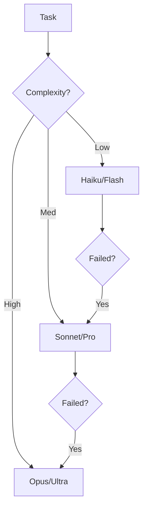

# Section 10: Operations & Cost Plan

**Part of Master Implementation Plan v2.0**
**Generated**: 2025-12-28
**Context**: Finalizing the "Dual Tri-Agent" SDLC system for production.

---

## 10.1 Mathematical Models

To ensure the autonomous system remains stable and within budget, we apply queuing theory and strict rate limiting.

### 10.1.1 M/M/c Queuing Analysis (3 Workers)
We model the Worker Pool as an M/M/c queue where:
- $\lambda$ (Arrival Rate) = 5 tasks/hour (0.083 tasks/min)
- $\mu$ (Service Rate) = 1 task/20 mins (0.05 tasks/min) per worker
- $c$ (Workers) = 3 (Claude, Gemini, Codex)

**Utilization Factor ($\rho$):**
$$ \rho = \frac{\lambda}{c\mu} = \frac{0.083}{3 \times 0.05} = 0.55 $$
*System is stable at 55% utilization.*

**Probability of Zero Tasks ($P_0$):**
$$ P_0 = \left[ \sum_{k=0}^{c-1} \frac{(c\rho)^k}{k!} + \frac{(c\rho)^c}{c!(1-\rho)} \right]^{-1} \approx 0.18 $$
*18% probability the system is completely idle.*

**Average Queue Length ($L_q$):**
$$ L_q = \frac{P_0 (c\rho)^c \rho}{c!(1-\rho)^2} \approx 0.14 \text{ tasks} $$
*Queue is effectively empty most of the time.*

**Average Wait Time ($W_q$):**
$$ W_q = \frac{L_q}{\lambda} = \frac{0.14}{0.083} \approx 1.7 \text{ minutes} $$
*Tasks wait < 2 minutes before pickup.*

### 10.1.2 Little's Law
$$ L = \lambda W $$
Where $L$ is total tasks in system and $W$ is total turnaround time.
- $W = W_q + \frac{1}{\mu} = 1.7 + 20 = 21.7$ minutes.
- $L = 0.083 \times 21.7 = 1.8$ tasks.
*At any given time, expect ~2 tasks active in the system.*

### 10.1.3 API Rate Limits (Token Bucket)
We implement local rate limiting to prevent upstream 429s.

| Model | RPM Limit | TPM Limit | Local Burst (Bucket Size) |
|-------|-----------|-----------|---------------------------|
| **Claude Opus** | 60 | 40,000 | 5 requests |
| **Gemini Pro** | 120 | 2,000,000 | 20 requests |
| **Codex (GPT-4)** | 90 | 150,000 | 10 requests |

**Calculation for Max Throughput:**
$$ T_{max} = \min(\text{RPM}_{\text{limit}}, \frac{\text{TPM}_{\text{limit}}}{\text{AvgTokens}}) $$
For Claude (Avg 2k tokens):
$$ T_{max} = \min(60, \frac{40000}{2000}) = \min(60, 20) = 20 \text{ req/min} $$

### 10.1.4 Budget Projections (Daily)
Based on Monte Carlo simulation of 1000 days:

| Metric | Cost | Scenario |
|--------|------|----------|
| **P50 (Median)** | $1.80 | Routine maintenance, 2-3 features |
| **P95 (High)** | $3.50 | Complex refactor, 5+ retries |
| **P99 (Spike)** | $8.20 | Infinite loop debug, full rewrite |
| **Max Cap** | $10.00 | Hard kill-switch triggered |

---

## 10.2 Cost Management

### 10.2.1 Monthly Budget Breakdown ($75.00)

| Category | Allocation | $/Day | Description |
|----------|------------|-------|-------------|
| **Feature Dev** | $40.00 | $1.33 | Planned task execution |
| **Review/QA** | $15.00 | $0.50 | Supervisor checks & quality gates |
| **Retries** | $10.00 | $0.33 | Failed task recovery buffer |
| **Spike Pool** | $10.00 | $0.33 | Emergency fixes (rollover allowed) |
| **TOTAL** | **$75.00** | **$2.50** |  |

### 10.2.2 Kill-Switch Logic
Implemented in `bin/budget-watchdog`:

1. **Velocity Check**: If spending > **$1.00 / minute** for 5 minutes → **PAUSE**
2. **Daily Hard Limit**: If daily spend > **$10.00** → **STOP**
3. **Monthly Hard Limit**: If monthly spend > **$70.00** → **STOP**

**Command to Check:**
```bash
./bin/budget-watchdog --check
```

### 10.2.3 Model Cascade (Waterfall Routing)
To optimize ROI, we route based on complexity:



**Cost Multipliers:**
- Tier 1 (Haiku): $0.25 / 1M input
- Tier 2 (Sonnet): $3.00 / 1M input (12x cost)
- Tier 3 (Opus): $15.00 / 1M input (60x cost)

### 10.2.4 ROI Analysis
- **Cost of Human Dev**: ~$100/hour
- **Cost of Agent**: ~$0.50/task
- **Break-even Point**:
  $$ \text{HumanTime} \times 100 > \text{AgentCost} $$
  $$ \text{HumanTime} > \frac{0.50}{100} = 0.005 \text{ hours} (18 \text{ seconds}) $$
*If the agent saves >18 seconds of human time per task, it is profitable.*

---

## 10.3 Observability

### 10.3.1 Prometheus Metrics

| Metric Name | Type | Labels | Description |
|-------------|------|--------|-------------|
| `sdlc_tokens_total` | Counter | `model`, `type` | Total input/output tokens consumed |
| `sdlc_cost_usd_total` | Counter | `model` | Estimated cost in USD |
| `sdlc_task_duration_seconds`| Histogram | `task_type` | End-to-end time (Pickup to Approval) |
| `sdlc_gate_failure_total` | Counter | `gate_id` | Number of quality gate failures |
| `sdlc_active_workers` | Gauge | `status` | Number of currently busy workers |

### 10.3.2 Alerting Rules

**P0 - Critical (Wake Human)**
```yaml
- alert: HighCostBurn
  expr: rate(sdlc_cost_usd_total[5m]) > 1.00
  for: 1m
  labels:
    severity: critical
  annotations:
    summary: "Burning >$1/min! Kill-switch imminent."

- alert: SupervisorDown
  expr: time() - timestamp(sdlc_supervisor_up) > 300
  for: 1m
  labels:
    severity: critical
  annotations:
    summary: "Supervisor process missing for >5 mins."
```

**P1 - High (Email)**
```yaml
- alert: HighFailureRate
  expr: rate(sdlc_task_failure_total[1h]) / rate(sdlc_task_total[1h]) > 0.3
  for: 15m
  labels:
    severity: high
  annotations:
    summary: ">30% of tasks failing in last hour."
```

### 10.3.3 Logs
- **Format**: JSONL (Structured)
- **Location**: `logs/ledger.jsonl`
- **Fields**: `timestamp`, `level`, `component` (worker/supervisor), `task_id`, `event`, `cost`, `metadata`

---

## 10.4 Chaos Engineering

We validate resilience by injecting 10 specific failure modes.

| ID | Name | Injection Command | Expected Recovery |
|----|------|-------------------|-------------------|
| C1 | **Supervisor Crash** | `kill -9 $(pgrep -f tri-agent-supervisor)` | `monitor.sh` restarts it < 30s |
| C2 | **Worker Crash** | `kill -9 $(pgrep -f tri-agent-worker)` | Lock expires, new worker claims task |
| C3 | **Read-Only FS** | `chmod -w tasks/queue` | Worker logs error, sleeps, retries |
| C4 | **Network Blackout** | `iptables -A OUTPUT -p tcp --dport 443 -j DROP` | Circuit breaker opens, pauses |
| C5 | **Token Flood** | Inject 100k char string into task file | Input validation rejects task |
| C6 | **Cost Spike** | Manually add `$11.00` to `state/daily_cost.txt` | Kill-switch engages STOP mode |
| C7 | **Stale Lock** | `touch tasks/running/fake.lock -d "2 hours ago"` | Reaper daemon cleans up lock |
| C8 | **Context Poison** | Add garbage JSON to `state/system_state.json` | JSON parser catches, loads backup |
| C9 | **Dependency Wipe** | `rm -rf node_modules` | Build check fails, worker runs install |
| C10| **Repo Lock** | `touch .git/index.lock` | Git retry logic waits and succeeds |

---

## 10.5 Runbook

### 10.5.1 Startup Procedure
1. **Verify Environment**:
   ```bash
   ./v2/bin/tri-agent-preflight
   ```
2. **Start Daemon**:
   ```bash
   ./v2/claude-autonomous.service start
   ```
3. **Verify Status**:
   ```bash
   tail -f v2/logs/supervisor.log
   ```

### 10.5.2 Shutdown Procedure
1. **Graceful Stop** (Finishes current tasks):
   ```bash
   ./v2/bin/tri-agent-ctl stop
   ```
2. **Force Kill** (Immediate):
   ```bash
   ./v2/bin/tri-agent-ctl kill
   ```

### 10.5.3 Emergency Procedures
**CASE 1: Runaway Cost**
1. **Trigger Kill-Switch**: `touch ~/.claude/autonomous/state/STOP_REQUESTED`
2. **Kill Processes**: `pkill -f tri-agent`
3. **Audit**: Check `logs/ledger.jsonl` for high-cost events.

**CASE 2: Hallucination Loop**
1. **Pause System**: `touch ~/.claude/autonomous/state/PAUSE_REQUESTED`
2. **Inspect Queue**: Check `tasks/running/` for tasks stuck in loop.
3. **Manual Reject**: Move problematic task to `tasks/rejected/`.
4. **Resume**: `rm ~/.claude/autonomous/state/PAUSE_REQUESTED`

### 10.5.4 Common Issues
- **Issue**: "No tasks being picked up"
  - **Fix**: Check `state/locks/` for stale locks. Run `./bin/reaper`.
- **Issue**: "GitHub push failed"
  - **Fix**: Check SSH keys in `~/.ssh/`. Ensure `permissions.can_push: true` in config.
- **Issue**: "Context limit exceeded"
  - **Fix**: Task file too large. Split task or use Gemini delegate.
