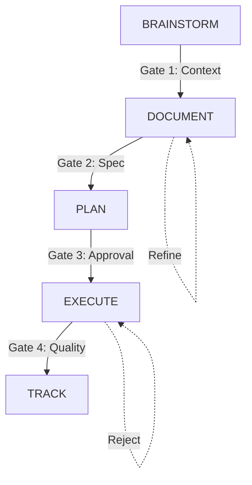

# SDLC Phase Handoff Specification

> **Version:** 1.0.0
> **Status:** APPROVED
> **Created:** 2025-12-28
> **Context:** Defines the interaction protocol between WORKER and SUPERVISOR agents across the SDLC.

---

## 1. System Overview

The Autonomous SDLC system divides responsibility between two primary agents:
- **SUPERVISOR**: Owns quality, gates, planning, and state transitions.
- **WORKER**: Owns execution, implementation, testing, and submission.

The lifecycle moves through 5 distinct phases. Transitions are strict "Handoff Points" enforced by file-system contracts.



---

## 2. Phase Transition Specifications

### Phase 1: BRAINSTORM → DOCUMENT

**Goal:** Transform a vague user request into a concrete requirements artifact.

| Component | Specification |
|-----------|---------------|
| **Inputs** | - User request (CLI/Issue) in `tasks/queue/NEW_*.md`<br>- Project Context (project structure, tech stack) |
| **Primary Actor** | **SUPERVISOR** (Analyzes request, gathers context) |
| **Secondary Actor** | **WORKER** (Scans codebase for related files) |
| **Outputs** | - `docs/requirements/{task_id}_req.md` (Draft Requirements) |
| **Quality Gate** | **Gate 1: Context Completeness**<br>- Check: Is the goal clear?<br>- Check: Are constraints defined?<br>- Check: Is tech stack alignment verified? |
| **Handoff** | Supervisor moves `tasks/queue/NEW_{id}.md` to `tasks/queue/DOC_{id}.md` |
| **Rollback** | If context unclear: Supervisor creates `tasks/escalations/{id}_CLARIFY.md` for User. |

#### Handoff Diagram
```text
[User Input] -> [tasks/queue/NEW_*.md]
                      |
                      v
             [SUPERVISOR: Analyze]
                      |
        (Is context sufficient?) --NO--> [Escalate to User]
                      | YES
                      v
        [Create docs/requirements/*_req.md]
                      |
                      v
       [Move to tasks/queue/DOC_*.md] -> [Ready for WORKER]
```

---

### Phase 2: DOCUMENT → PLAN

**Goal:** Convert requirements into a technical specification with acceptance criteria.

| Component | Specification |
|-----------|---------------|
| **Inputs** | - `tasks/queue/DOC_{id}.md`<br>- `docs/requirements/{id}_req.md` |
| **Primary Actor** | **WORKER** (Drafts specification) |
| **Secondary Actor** | **SUPERVISOR** (Reviews and critiques) |
| **Outputs** | - `docs/specs/{id}_spec.md` (Final Specification) |
| **Quality Gate** | **Gate 2: Spec Validation**<br>- Check: Acceptance Criteria present?<br>- Check: Test scenarios defined?<br>- Check: Security implications analyzed? |
| **Handoff** | Supervisor signs off `docs/specs/{id}_spec.md` and creates `tasks/queue/PLAN_{id}.md` |
| **Rollback** | Supervisor comments on `docs/specs/{id}_spec.md`. Worker iterates. |

#### Coordination Protocol (Collaborative)
1. Worker picks up `DOC_{id}.md`.
2. Worker writes `docs/specs/{id}_spec.md`.
3. Worker moves task to `tasks/review/DOC_{id}.md`.
4. Supervisor reviews.
   - If **REJECT**: Moves to `tasks/queue/DOC_{id}.md` with comments.
   - If **APPROVE**: Moves to `tasks/queue/PLAN_{id}.md`.

---

### Phase 3: PLAN → EXECUTE

**Goal:** Break specification into atomic, executable tasks.

| Component | Specification |
|-----------|---------------|
| **Inputs** | - `tasks/queue/PLAN_{id}.md`<br>- `docs/specs/{id}_spec.md` |
| **Primary Actor** | **SUPERVISOR** (Decomposition & Planning) |
| **Secondary Actor** | **WORKER** (Effort Estimation) |
| **Outputs** | - `docs/plans/{id}_plan.md` (Execution Plan)<br>- Atomic Tasks: `tasks/queue/EXEC_{id}_01.md`, `EXEC_{id}_02.md`, etc. |
| **Quality Gate** | **Gate 3: Plan Approval**<br>- Check: Are tasks atomic (< 1 hour)?<br>- Check: Are dependencies mapped?<br>- Check: Is retry budget assigned? |
| **Handoff** | Supervisor creates atomic task files in `tasks/queue/`. |
| **Rollback** | Re-planning. Supervisor updates `docs/plans/{id}_plan.md` and regenerates tasks. |

#### Handoff Diagram
```text
      [tasks/queue/PLAN_*.md]
                |
                v
      [SUPERVISOR: Decompose]
                |
    +-----------+-----------+
    |           |           |
    v           v           v
[EXEC_01]   [EXEC_02]   [EXEC_03]  -> [tasks/queue/]
```

---

### Phase 4: EXECUTE → TRACK

**Goal:** Implement code, pass tests, and merge changes.

| Component | Specification |
|-----------|---------------|
| **Inputs** | - `tasks/queue/EXEC_{id}_{seq}.md`<br>- Codebase |
| **Primary Actor** | **WORKER** (Implementation) |
| **Secondary Actor** | **SUPERVISOR** (Audit & Merge) |
| **Outputs** | - Code changes (Git Commit)<br>- Test Results<br>- Updated `docs/plans/{id}_plan.md` (Progress) |
| **Quality Gate** | **Gate 4: Execution Quality** (The "12-Check Gate")<br>- Syntax, Tests, Coverage, Lint, Security, Build, Deps, Breaking, Review, Perf, Docs, Commit. |
| **Handoff** | Worker submits to `tasks/review/`. Supervisor moves to `tasks/completed/` or `tasks/rejected/`. |
| **Rollback** | **Rejection Loop:** Supervisor moves task to `tasks/rejected/` with `feedback.md`. Worker picks up, fixes, resubmits. |

#### Rollback Procedure (Detailed)
1. **Submit:** Worker moves task to `tasks/review/`.
2. **Review:** Supervisor runs Gate 4.
3. **Decision:**
   - **PASS:** Merge code, move task to `tasks/completed/`.
   - **FAIL:**
     1. Generate `tasks/supervisor_feedback/FEEDBACK_{id}.md`.
     2. Move task to `tasks/rejected/`.
     3. Increment Retry Count in `tasks/history/{id}.json`.
     4. If Retries > 3: Move to `tasks/failed/` (Human Escalation).

---

## 3. Operational Mechanics

### 3.1 Task Generation (Supervisor)
The Supervisor generates tasks by writing Markdown files to `tasks/queue/`.
**Naming Convention:** `{TYPE}_{PARENT-ID}_{SEQ}.md`
- `TYPE`: `DOC`, `PLAN`, `EXEC`
- `PARENT-ID`: The original request ID.
- `SEQ`: Sequence number for execution tasks (e.g., `01`, `02`).

### 3.2 Task Pickup (Worker)
The Worker polls `tasks/queue/` using a priority-based fetch:
1. `CRITICAL_*`
2. `HIGH_*`
3. `MEDIUM_*`
4. `LOW_*`

**Locking:** Worker moves file to `tasks/running/` and creates a `.lock` file to prevent double-execution.

### 3.3 State Persistence
State is maintained via the file system to ensure resilience across agent restarts.

| State | Storage Location | Schema |
|-------|------------------|--------|
| **Task Status** | Directory (`queue`, `running`, `review`, `completed`) | N/A (Folder location implies status) |
| **Lineage** | `tasks/history/{id}.json` | `{"id": "...", "retries": 0, "parent": "...", "status": "..."}` |
| **Gate Results** | `state/gates/{id}_{gate}.json` | `{"gate": "4", "score": 85, "checks": [...]}` |
| **Feedback** | `tasks/supervisor_feedback/` | Markdown files linked to Task ID. |

### 3.4 IPC (Inter-Process Communication)
Agents communicate asynchronously via JSON payloads in `comms/`.

- **Supervisor -> Worker:** `comms/worker/inbox/`
- **Worker -> Supervisor:** `comms/supervisor/inbox/`

**Message Types:**
- `TASK_ASSIGNED`
- `TASK_SUBMITTED`
- `TASK_REJECTED`
- `TASK_APPROVED`
- `CLARIFICATION_REQUEST`

---

## 4. Visual Summary

```text
+-------------------+        +-------------------+
|    SUPERVISOR     |        |      WORKER       |
+-------------------+        +-------------------+
         |                            |
    [BRAINSTORM]                      |
         |                            |
    (Create DOC task) -------------> [POLL QUEUE]
         |                            |
         |                       [DOCUMENT]
    [REVIEW DOC] <----------------- (Submit)
         |                            |
    (Create PLAN task) ------------> [POLL QUEUE]
         |                            |
         |                          [WAIT]
      [PLANNING]                      |
         |                            |
    (Create EXEC tasks) -----------> [POLL QUEUE]
         |                            |
         |                        [EXECUTE]
     [AUDIT/GATE] <---------------- (Submit)
         |                            |
    [MERGE/TRACK]                     |
         |                            |
       (Done) <-----------------------+
```
