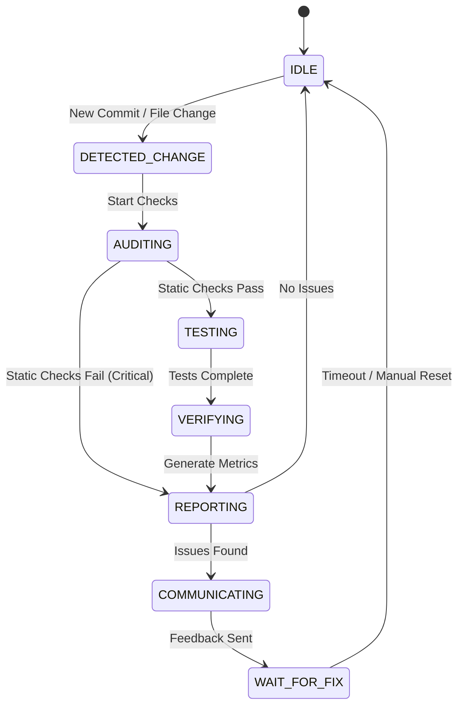

# Tri-Agent Supervisor/Auditor System Design

## 1. System Overview

The Tri-Agent Supervisor is an autonomous monitoring process designed to run alongside the primary development agent (`tri-agent-aadel-v2`). Its goal is to ensure code quality, security, and correctness without interrupting the primary agent's flow unless critical issues arise.

### Architecture

```mermaid
graph TD
    subgraph Primary Session [Primary Session (tmux: claude-tri-agent)]
        A[Claude Agent] -->|Writes Code| B[File System]
        A -->|Commits| C[Git Repo]
        A -->|Reads| D[Feedback Inbox]
    end

    subgraph Supervisor Session [Supervisor Session (tmux: tri-agent-supervisor)]
        S[Supervisor Loop] -->|Polls| C
        S -->|Executes| T[Test Runner]
        S -->|Executes| L[Linters/Security]
        S -->|Updates| ST[State/Status]
        S -->|Writes| D
    end

    subgraph Shared State
        ST
        logs[Audit Logs]
    end
```

## 2. Supervisor Workflow State Machine

The supervisor operates on a continuous loop with the following states:

1.  **IDLE**: Sleeping, polling for new git commits or file changes (using `git log` or `inotify`).
2.  **DETECTED_CHANGE**: Triggered by a new commit hash.
3.  **AUDITING**: Running static analysis (shellcheck, security audit).
4.  **TESTING**: Running test suite (`tests/run_tests.sh`).
5.  **VERIFYING**: Aggregating results, checking coverage thresholds.
6.  **REPORTING**: Generates `audit_report_<hash>.json`.
7.  **COMMUNICATING**: If issues found > threshold, write to `tasks/supervisor_feedback/`.

### State Transitions



## 3. Communication Protocol

### Supervisor -> Primary (Feedback)

The supervisor writes actionable feedback items to:
`tasks/supervisor_feedback/ISSUE_<TIMESTAMP>_<SEVERITY>.md`

**Format:**
```markdown
# Supervisor Feedback: [CRITICAL] Security Vulnerability Detected

**Context:** Commit `a1b2c3d`
**File:** `bin/process_data.sh`

## Issue
Hardcoded API Key detected on line 15.

## Remediation
Use `process_env` variable.

## Severity
CRITICAL - Immediate Fix Required.
```

The Primary Agent (Claude) is instructed to check this directory before starting new tasks or after every commit.

### Primary -> Supervisor

The primary agent communicates implicitly via:
1.  **Git Commits**: The primary source of truth.
2.  **Commit Messages**: Can include tags like `[skip-audit]` (use sparingly) or `[fix-123]` to signal intent.

## 4. Issue Severity & Classification

| Level | Description | Action |
| :--- | :--- | :--- |
| **CRITICAL** | Security vuln, Build break, Data loss risk | **BLOCKING**: Send urgent feedback, potentially signal primary to stop. |
| **HIGH** | Test failure, Logic error, Performance regression | **URGENT**: Add to top of feedback queue. |
| **MEDIUM** | Lint warning, Coverage drop, Style violation | **BATCH**: Report in next batch or daily summary. |
| **LOW** | Typos, Minor suggestions | **LOG**: Only log to file, do not interrupt. |

## 5. Data Structures

### Audit Report Schema (`logs/audit/report_<hash>.json`)

```json
{
  "timestamp": "2025-12-28T10:00:00Z",
  "commit_hash": "a1b2c3d...",
  "status": "FAIL",
  "metrics": {
    "coverage": 85.5,
    "test_pass_rate": 0.98,
    "security_score": "B"
  },
  "issues": [
    {
      "id": "SEC-001",
      "severity": "CRITICAL",
      "type": "SECRET_EXPOSURE",
      "file": "bin/app.sh",
      "line": 42,
      "description": "Found potential AWS key"
    }
  ]
}
```

## 6. Rate Limiting & Recovery

### Rate Limiting
- **Debounce**: Wait 30s after a file change before auditing (if not committed).
- **Commit Batching**: If 5 commits happen in 10s, audit the `HEAD` only, but scan changed files from all 5.
- **Resource Cap**: Supervisor uses `nice` to lower priority.

### Failure Recovery
- **Watchdog**: A separate cron/systemd process checks if `tri-agent-supervisor` is running.
- **State Recovery**: On restart, supervisor reads `state/supervisor/last_checked_commit` to resume.
- **Self-Healing**: If `tests/run_tests.sh` hangs (>5m), supervisor kills it and reports TIMEOUT.

## 7. Implementation Plan

1.  **`bin/tri-agent-supervisor`**: Main loop script.
2.  **`lib/supervisor-core.sh`**: Helper functions for auditing and reporting.
3.  **`state/supervisor/`**: Directory for state tracking.
4.  **`tasks/supervisor_feedback/`**: Directory for inbox.

